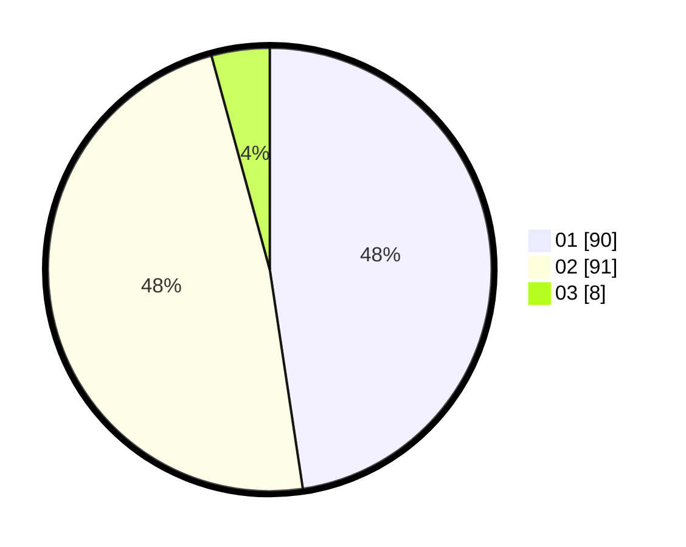

# Hasil

Hasil perolehan suara paslon dapat dilihat pada file paslon-01.txt, paslon-02.txt, dan paslon-03.txt.

Jika tidak ada, artinya data tersebut belum ada pada SIREKAP.

## Perolehan Suara

 * Paslon 01: **90**.
 * Paslon 02: **91**.
 * Paslon 03: **8**.

## Foto C Plano

https://sirekap-obj-formc.kpu.go.id/bc0e/pemilu/ppwp/31/72/03/10/04/3172031004075-20240215-224907--40255c7d-e5f2-4520-b2cb-a6970a6e8b68.jpg

https://sirekap-obj-formc.kpu.go.id/bc0e/pemilu/ppwp/31/72/03/10/04/3172031004075-20240215-224910--faed4d6b-3fab-4702-8a75-d48d166d4908.jpg

https://sirekap-obj-formc.kpu.go.id/bc0e/pemilu/ppwp/31/72/03/10/04/3172031004075-20240215-224908--d0aa49ab-0b34-46dc-8d08-fd4e24c24ac5.jpg

## DATA PEMILIH TETAP

Jumlah pemilih dalam DPT: **291**.
 * L: **142**.
 * P: **149**.

## DATA PENGGUNA HAK PILIH

Jumlah pengguna hak pilih dalam DPT: **185**.
 * L: **83**.
 * P: **102**.

Jumlah pengguna hak pilih dalam DPTb: **5**.
 * L: **3**.
 * P: **2**.

Jumlah pengguna hak pilih dalam DPK: **0**.
 * L: **0**.
 * P: **0**.

Jumlah pengguna hak pilih: **190**.
 * L: **86**.
 * P: **104**.

## JUMLAH SUARA SAH DAN TIDAK SAH

JUMLAH SELURUH SUARA SAH: **189**.

JUMLAH SUARA TIDAK SAH: **1**.

JUMLAH SELURUH SUARA SAH DAN SUARA TIDAK SAH: **190**.
