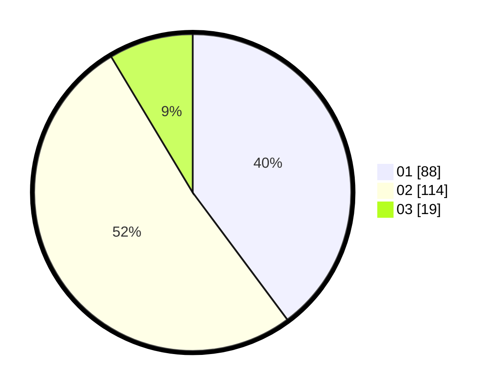

# Hasil

Hasil perolehan suara paslon dapat dilihat pada file paslon-01.txt, paslon-02.txt, dan paslon-03.txt.

Jika tidak ada, artinya data tersebut belum ada pada SIREKAP.

## Perolehan Suara

 * Paslon 01: **88**.
 * Paslon 02: **114**.
 * Paslon 03: **19**.

## Foto C Plano

https://sirekap-obj-formc.kpu.go.id/9b98/pemilu/ppwp/31/72/03/10/04/3172031004076-20240216-154109--8a4c73bb-3464-40be-a0a8-e09ec2043360.jpg

https://sirekap-obj-formc.kpu.go.id/9b98/pemilu/ppwp/31/72/03/10/04/3172031004076-20240216-154111--e6773937-3861-45c1-8784-5dee4237f5a0.jpg

https://sirekap-obj-formc.kpu.go.id/9b98/pemilu/ppwp/31/72/03/10/04/3172031004076-20240216-154110--6024eeb8-cec6-488d-8db4-f123eefac64f.jpg

## DATA PEMILIH TETAP

Jumlah pemilih dalam DPT: **280**.
 * L: **141**.
 * P: **139**.

## DATA PENGGUNA HAK PILIH

Jumlah pengguna hak pilih dalam DPT: **224**.
 * L: **108**.
 * P: **116**.

Jumlah pengguna hak pilih dalam DPTb: **0**.
 * L: **0**.
 * P: **0**.

Jumlah pengguna hak pilih dalam DPK: **0**.
 * L: **0**.
 * P: **0**.

Jumlah pengguna hak pilih: **224**.
 * L: **108**.
 * P: **116**.

## JUMLAH SUARA SAH DAN TIDAK SAH

JUMLAH SELURUH SUARA SAH: **221**.

JUMLAH SUARA TIDAK SAH: **3**.

JUMLAH SELURUH SUARA SAH DAN SUARA TIDAK SAH: **224**.
