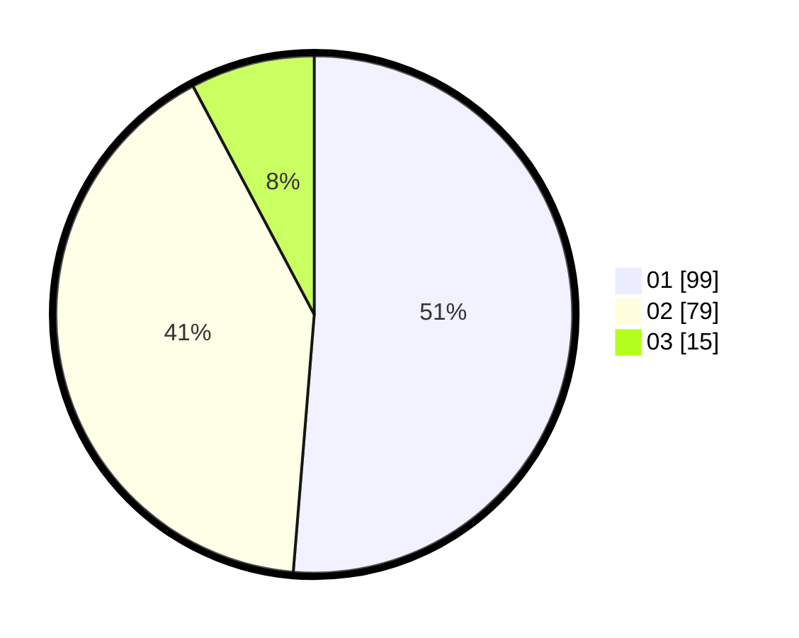

# Hasil

Hasil perolehan suara paslon dapat dilihat pada file paslon-01.txt, paslon-02.txt, dan paslon-03.txt.

Jika tidak ada, artinya data tersebut belum ada pada SIREKAP.

## Perolehan Suara

 * Paslon 01: **99**.
 * Paslon 02: **79**.
 * Paslon 03: **15**.

## Foto C Plano

https://sirekap-obj-formc.kpu.go.id/d231/pemilu/ppwp/31/72/03/10/04/3172031004078-20240216-173727--6edbeca3-3976-47c0-8a6b-9a5a62734f90.jpg

https://sirekap-obj-formc.kpu.go.id/d231/pemilu/ppwp/31/72/03/10/04/3172031004078-20240216-173728--41b68683-6293-4213-b9f1-b4a7af5af3e5.jpg

https://sirekap-obj-formc.kpu.go.id/d231/pemilu/ppwp/31/72/03/10/04/3172031004078-20240216-173727--4e239b5d-b011-49b7-9da7-914580fee342.jpg

## DATA PEMILIH TETAP

Jumlah pemilih dalam DPT: **285**.
 * L: **147**.
 * P: **138**.

## DATA PENGGUNA HAK PILIH

Jumlah pengguna hak pilih dalam DPT: **191**.
 * L: **95**.
 * P: **96**.

Jumlah pengguna hak pilih dalam DPTb: **0**.
 * L: **0**.
 * P: **0**.

Jumlah pengguna hak pilih dalam DPK: **3**.
 * L: **2**.
 * P: **1**.

Jumlah pengguna hak pilih: **194**.
 * L: **97**.
 * P: **97**.

## JUMLAH SUARA SAH DAN TIDAK SAH

JUMLAH SELURUH SUARA SAH: **193**.

JUMLAH SUARA TIDAK SAH: **1**.

JUMLAH SELURUH SUARA SAH DAN SUARA TIDAK SAH: **194**.
