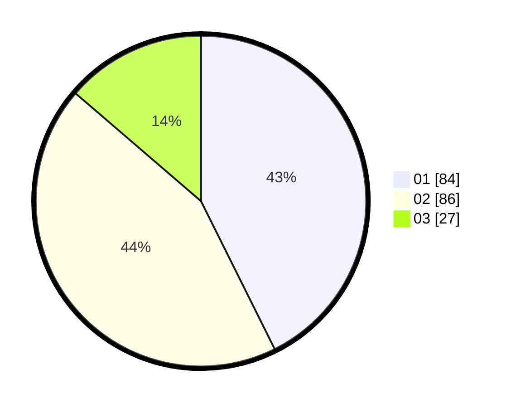

# Hasil

Hasil perolehan suara paslon dapat dilihat pada file paslon-01.txt, paslon-02.txt, dan paslon-03.txt.

Jika tidak ada, artinya data tersebut belum ada pada SIREKAP.

## Perolehan Suara

 * Paslon 01: **84**.
 * Paslon 02: **86**.
 * Paslon 03: **27**.

## Foto C Plano

https://sirekap-obj-formc.kpu.go.id/4488/pemilu/ppwp/31/72/03/10/04/3172031004080-20240216-173511--763959dd-afff-4fac-9cc5-e54bbed29d83.jpg

https://sirekap-obj-formc.kpu.go.id/4488/pemilu/ppwp/31/72/03/10/04/3172031004080-20240216-173512--f8e48783-fa21-4398-a992-b9e4cc8cf319.jpg

https://sirekap-obj-formc.kpu.go.id/4488/pemilu/ppwp/31/72/03/10/04/3172031004080-20240216-173512--b0d53fa4-19d7-4bbd-addb-e5bc7bdff993.jpg

## DATA PEMILIH TETAP

Jumlah pemilih dalam DPT: **282**.
 * L: **141**.
 * P: **141**.

## DATA PENGGUNA HAK PILIH

Jumlah pengguna hak pilih dalam DPT: **200**.
 * L: **95**.
 * P: **105**.

Jumlah pengguna hak pilih dalam DPTb: **0**.
 * L: **0**.
 * P: **0**.

Jumlah pengguna hak pilih dalam DPK: **2**.
 * L: **2**.
 * P: **0**.

Jumlah pengguna hak pilih: **202**.
 * L: **97**.
 * P: **105**.

## JUMLAH SUARA SAH DAN TIDAK SAH

JUMLAH SELURUH SUARA SAH: **197**.

JUMLAH SUARA TIDAK SAH: **5**.

JUMLAH SELURUH SUARA SAH DAN SUARA TIDAK SAH: **202**.
