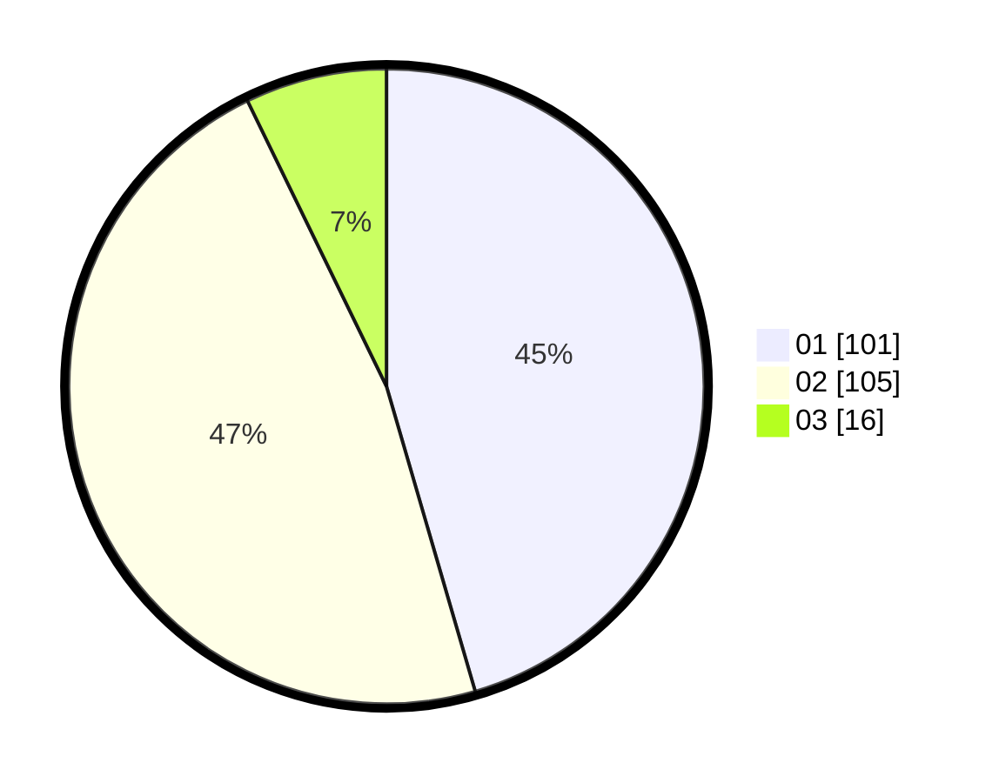

# Hasil

Hasil perolehan suara paslon dapat dilihat pada file paslon-01.txt, paslon-02.txt, dan paslon-03.txt.

Jika tidak ada, artinya data tersebut belum ada pada SIREKAP.

## Perolehan Suara

 * Paslon 01: **101**.
 * Paslon 02: **105**.
 * Paslon 03: **16**.

## Foto C Plano

https://sirekap-obj-formc.kpu.go.id/16eb/pemilu/ppwp/31/72/03/10/04/3172031004081-20240214-185929--07addaf2-baed-427c-889c-0e4b3b62a61f.jpg

https://sirekap-obj-formc.kpu.go.id/16eb/pemilu/ppwp/31/72/03/10/04/3172031004081-20240214-191916--bd455711-209e-4ead-858b-db7086997449.jpg

https://sirekap-obj-formc.kpu.go.id/16eb/pemilu/ppwp/31/72/03/10/04/3172031004081-20240214-191347--c73bc5c4-c675-40f7-987e-cf06907f7b8e.jpg

## DATA PEMILIH TETAP

Jumlah pemilih dalam DPT: **224**.
 * L: **107**.
 * P: **117**.

## DATA PENGGUNA HAK PILIH

Jumlah pengguna hak pilih dalam DPT: **280**.
 * L: **136**.
 * P: **144**.

Jumlah pengguna hak pilih dalam DPTb: **0**.
 * L: **0**.
 * P: **0**.

Jumlah pengguna hak pilih dalam DPK: **1**.
 * L: **1**.
 * P: **0**.

Jumlah pengguna hak pilih: **281**.
 * L: **137**.
 * P: **144**.

## JUMLAH SUARA SAH DAN TIDAK SAH

JUMLAH SELURUH SUARA SAH: **222**.

JUMLAH SUARA TIDAK SAH: **3**.

JUMLAH SELURUH SUARA SAH DAN SUARA TIDAK SAH: **225**.
