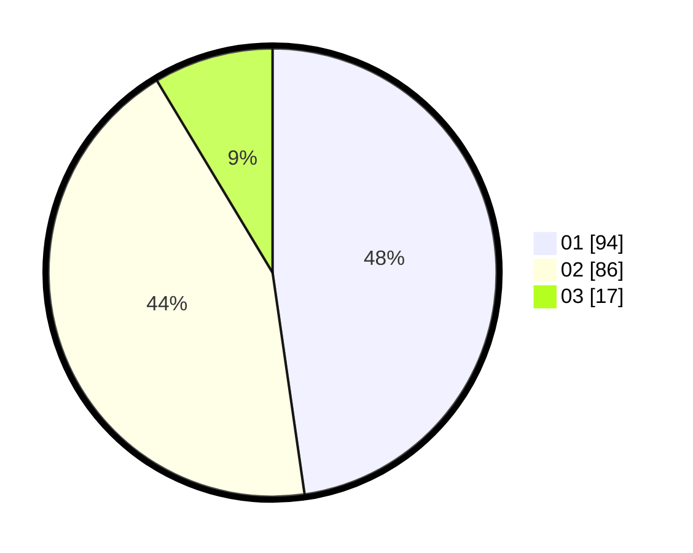

# Hasil

Hasil perolehan suara paslon dapat dilihat pada file paslon-01.txt, paslon-02.txt, dan paslon-03.txt.

Jika tidak ada, artinya data tersebut belum ada pada SIREKAP.

## Perolehan Suara

 * Paslon 01: **94**.
 * Paslon 02: **86**.
 * Paslon 03: **17**.

## Foto C Plano

https://sirekap-obj-formc.kpu.go.id/1d93/pemilu/ppwp/31/72/03/10/04/3172031004082-20240216-173752--881aec05-cce3-4776-84d3-040b13f60f58.jpg

https://sirekap-obj-formc.kpu.go.id/1d93/pemilu/ppwp/31/72/03/10/04/3172031004082-20240216-173753--c5c91760-164b-49e1-858a-8e3abbd737fb.jpg

https://sirekap-obj-formc.kpu.go.id/1d93/pemilu/ppwp/31/72/03/10/04/3172031004082-20240216-173753--5617e23d-6a8a-47a9-a4db-783aec8ff7b4.jpg

## DATA PEMILIH TETAP

Jumlah pemilih dalam DPT: **284**.
 * L: **144**.
 * P: **140**.

## DATA PENGGUNA HAK PILIH

Jumlah pengguna hak pilih dalam DPT: **197**.
 * L: **96**.
 * P: **101**.

Jumlah pengguna hak pilih dalam DPTb: **3**.
 * L: **2**.
 * P: **1**.

Jumlah pengguna hak pilih dalam DPK: **0**.
 * L: **0**.
 * P: **0**.

Jumlah pengguna hak pilih: **200**.
 * L: **98**.
 * P: **102**.

## JUMLAH SUARA SAH DAN TIDAK SAH

JUMLAH SELURUH SUARA SAH: **197**.

JUMLAH SUARA TIDAK SAH: **3**.

JUMLAH SELURUH SUARA SAH DAN SUARA TIDAK SAH: **200**.
