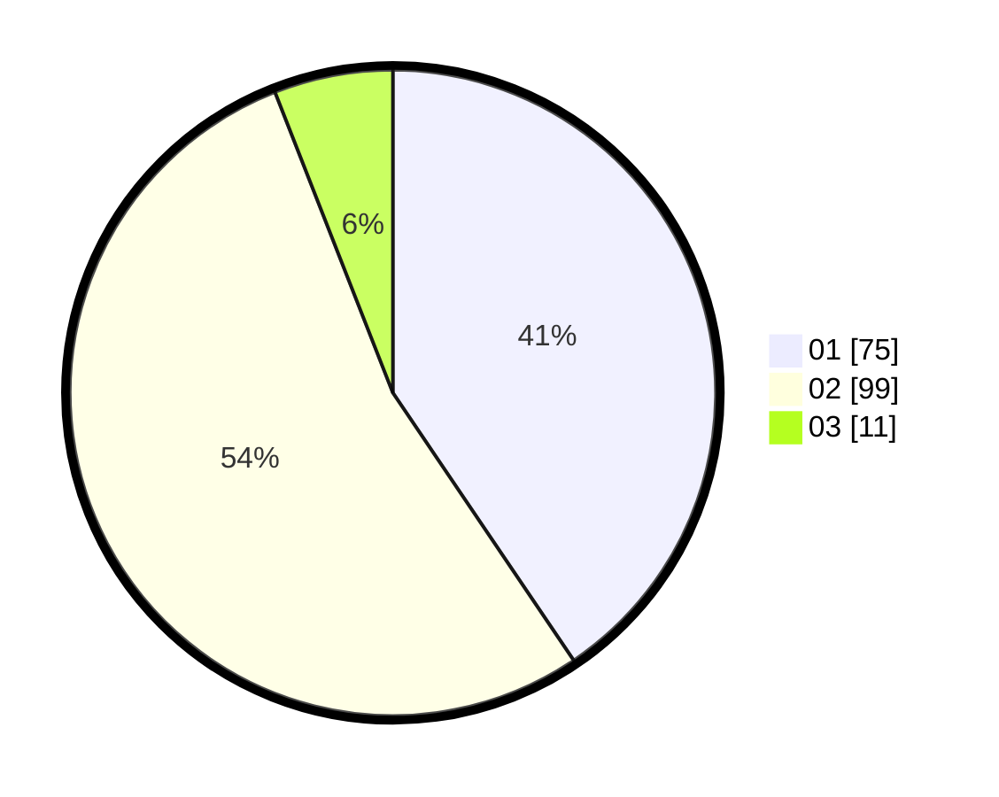

# Hasil

Hasil perolehan suara paslon dapat dilihat pada file paslon-01.txt, paslon-02.txt, dan paslon-03.txt.

Jika tidak ada, artinya data tersebut belum ada pada SIREKAP.

## Perolehan Suara

 * Paslon 01: **75**.
 * Paslon 02: **99**.
 * Paslon 03: **11**.

## Foto C Plano

https://sirekap-obj-formc.kpu.go.id/558c/pemilu/ppwp/31/72/03/10/04/3172031004083-20240214-192717--47d76770-2fac-4524-ac84-b7421a8a9ff4.jpg

https://sirekap-obj-formc.kpu.go.id/558c/pemilu/ppwp/31/72/03/10/04/3172031004083-20240214-192725--9b9eee52-1c4f-4b9b-ae84-0da42e1ca3e6.jpg

https://sirekap-obj-formc.kpu.go.id/558c/pemilu/ppwp/31/72/03/10/04/3172031004083-20240214-192733--dcc4b644-6cfb-4236-bba5-11213d9d3dc6.jpg

## DATA PEMILIH TETAP

Jumlah pemilih dalam DPT: **276**.
 * L: **138**.
 * P: **138**.

## DATA PENGGUNA HAK PILIH

Jumlah pengguna hak pilih dalam DPT: **187**.
 * L: **86**.
 * P: **101**.

Jumlah pengguna hak pilih dalam DPTb: **0**.
 * L: **0**.
 * P: **0**.

Jumlah pengguna hak pilih dalam DPK: **0**.
 * L: **0**.
 * P: **0**.

Jumlah pengguna hak pilih: **187**.
 * L: **86**.
 * P: **101**.

## JUMLAH SUARA SAH DAN TIDAK SAH

JUMLAH SELURUH SUARA SAH: **185**.

JUMLAH SUARA TIDAK SAH: **2**.

JUMLAH SELURUH SUARA SAH DAN SUARA TIDAK SAH: **187**.
