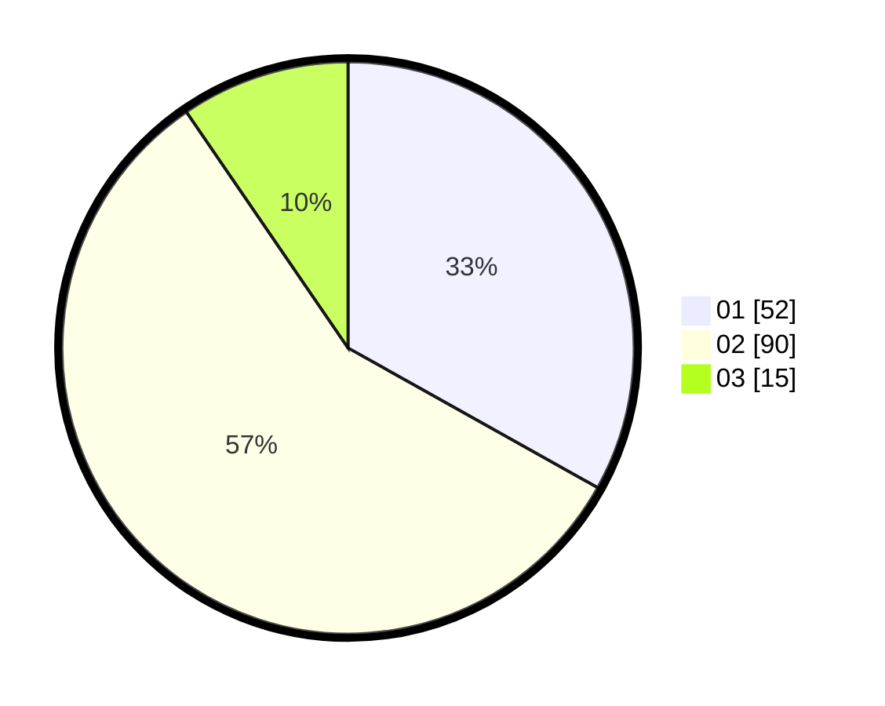

# Hasil

Hasil perolehan suara paslon dapat dilihat pada file paslon-01.txt, paslon-02.txt, dan paslon-03.txt.

Jika tidak ada, artinya data tersebut belum ada pada SIREKAP.

## Perolehan Suara

 * Paslon 01: **52**.
 * Paslon 02: **90**.
 * Paslon 03: **15**.

## Foto C Plano

https://sirekap-obj-formc.kpu.go.id/db7f/pemilu/ppwp/31/72/03/10/04/3172031004088-20240215-021306--7d76ae69-0cde-4e28-9249-a0009eb67abf.jpg

https://sirekap-obj-formc.kpu.go.id/db7f/pemilu/ppwp/31/72/03/10/04/3172031004088-20240215-021404--b4553629-48d4-4537-9aab-baffedf7608c.jpg

https://sirekap-obj-formc.kpu.go.id/db7f/pemilu/ppwp/31/72/03/10/04/3172031004088-20240215-021719--0c626507-da45-4cac-938e-8f3a469b8f4e.jpg
