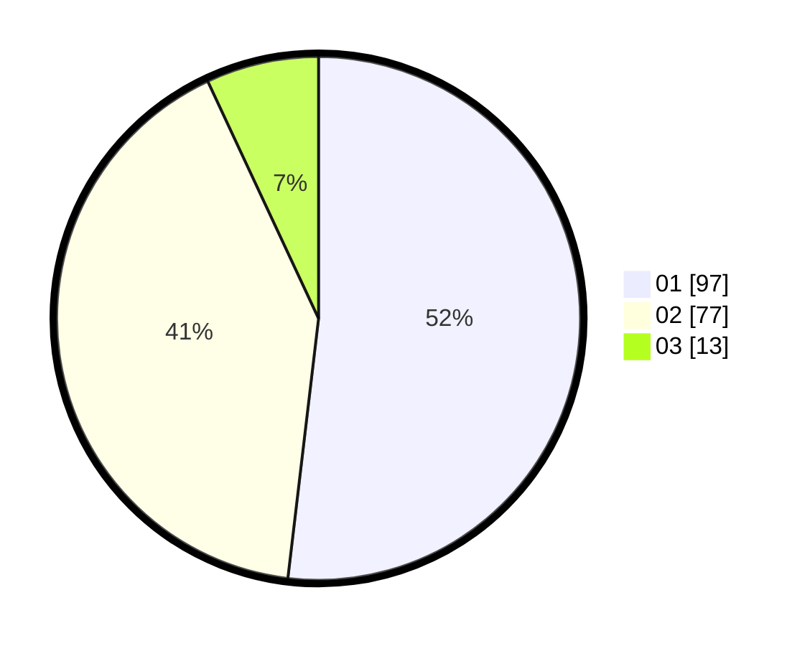

# Hasil

Hasil perolehan suara paslon dapat dilihat pada file paslon-01.txt, paslon-02.txt, dan paslon-03.txt.

Jika tidak ada, artinya data tersebut belum ada pada SIREKAP.

## Perolehan Suara

 * Paslon 01: **97**.
 * Paslon 02: **77**.
 * Paslon 03: **13**.

## Foto C Plano

https://sirekap-obj-formc.kpu.go.id/ea31/pemilu/ppwp/31/72/03/10/04/3172031004089-20240215-211709--a88e5308-a42c-4bbf-8b99-e6dbfa5925b1.jpg

https://sirekap-obj-formc.kpu.go.id/ea31/pemilu/ppwp/31/72/03/10/04/3172031004089-20240215-211711--36521ba3-caf2-479f-9b46-f4f2f3b88798.jpg

https://sirekap-obj-formc.kpu.go.id/ea31/pemilu/ppwp/31/72/03/10/04/3172031004089-20240215-211709--f1b4829d-fc7c-4539-b344-35fcaf077613.jpg

## DATA PEMILIH TETAP

Jumlah pemilih dalam DPT: **0**.
 * L: **0**.
 * P: **0**.

## DATA PENGGUNA HAK PILIH

Jumlah pengguna hak pilih dalam DPT: **0**.
 * L: **0**.
 * P: **0**.

Jumlah pengguna hak pilih dalam DPTb: **0**.
 * L: **0**.
 * P: **0**.

Jumlah pengguna hak pilih dalam DPK: **0**.
 * L: **0**.
 * P: **0**.

Jumlah pengguna hak pilih: **0**.
 * L: **0**.
 * P: **0**.

## JUMLAH SUARA SAH DAN TIDAK SAH

JUMLAH SELURUH SUARA SAH: **187**.

JUMLAH SUARA TIDAK SAH: **7**.

JUMLAH SELURUH SUARA SAH DAN SUARA TIDAK SAH: **194**.
