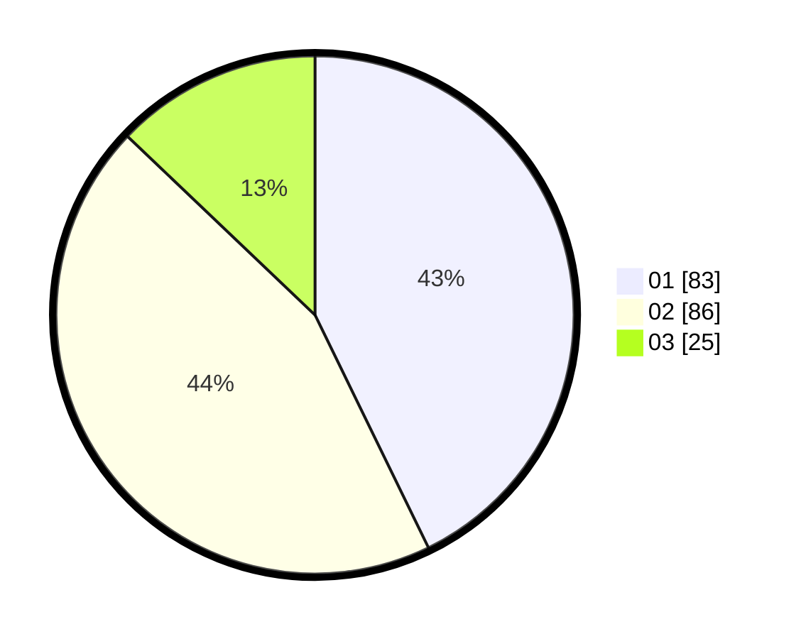

# Hasil

Hasil perolehan suara paslon dapat dilihat pada file paslon-01.txt, paslon-02.txt, dan paslon-03.txt.

Jika tidak ada, artinya data tersebut belum ada pada SIREKAP.

## Perolehan Suara

 * Paslon 01: **83**.
 * Paslon 02: **86**.
 * Paslon 03: **25**.

## Foto C Plano

https://sirekap-obj-formc.kpu.go.id/ba87/pemilu/ppwp/31/72/03/10/04/3172031004090-20240214-212843--8670dd1c-ca13-4bac-9e9f-eb54274f8b59.jpg

https://sirekap-obj-formc.kpu.go.id/ba87/pemilu/ppwp/31/72/03/10/04/3172031004090-20240214-203419--3ffc93e9-d229-4647-9373-5d5275cccc72.jpg

https://sirekap-obj-formc.kpu.go.id/ba87/pemilu/ppwp/31/72/03/10/04/3172031004090-20240214-203822--6305fb76-1c04-4438-85b0-f855ba447c27.jpg

## DATA PEMILIH TETAP

Jumlah pemilih dalam DPT: **287**.
 * L: **159**.
 * P: **128**.

## DATA PENGGUNA HAK PILIH

Jumlah pengguna hak pilih dalam DPT: **194**.
 * L: **95**.
 * P: **99**.

Jumlah pengguna hak pilih dalam DPTb: **1**.
 * L: **1**.
 * P: **0**.

Jumlah pengguna hak pilih dalam DPK: **3**.
 * L: **2**.
 * P: **1**.

Jumlah pengguna hak pilih: **198**.
 * L: **98**.
 * P: **100**.

## JUMLAH SUARA SAH DAN TIDAK SAH

JUMLAH SELURUH SUARA SAH: **194**.

JUMLAH SUARA TIDAK SAH: **4**.

JUMLAH SELURUH SUARA SAH DAN SUARA TIDAK SAH: **198**.
