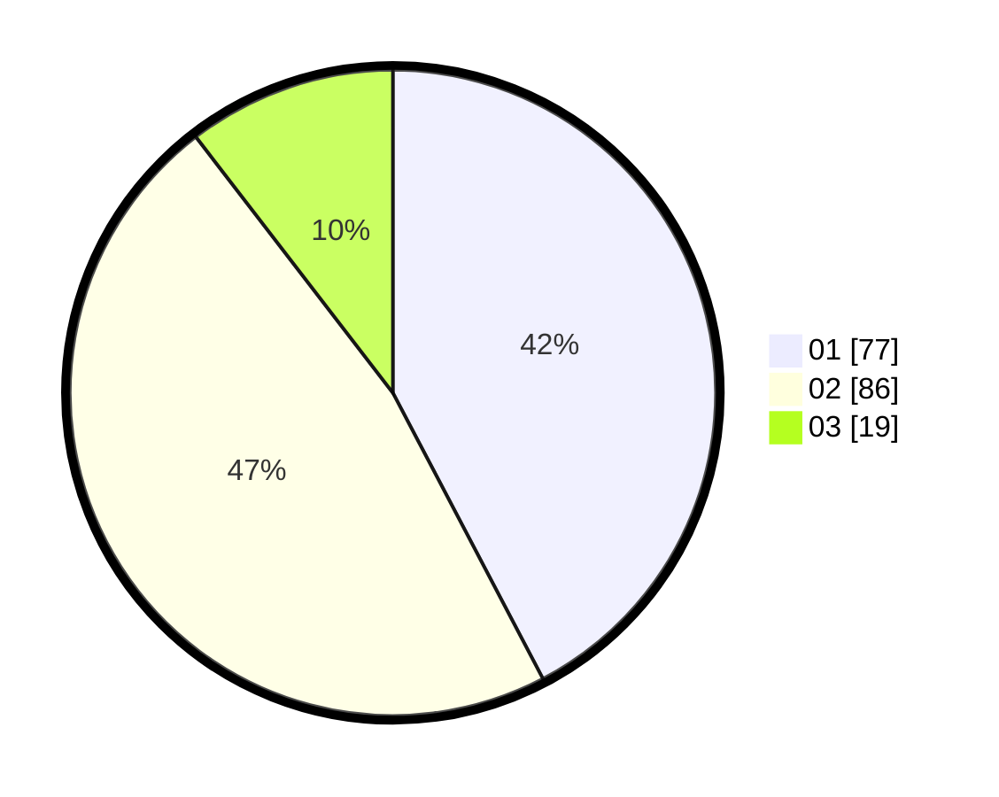

# Hasil

Hasil perolehan suara paslon dapat dilihat pada file paslon-01.txt, paslon-02.txt, dan paslon-03.txt.

Jika tidak ada, artinya data tersebut belum ada pada SIREKAP.

## Perolehan Suara

 * Paslon 01: **77**.
 * Paslon 02: **86**.
 * Paslon 03: **19**.

## Foto C Plano

https://sirekap-obj-formc.kpu.go.id/4592/pemilu/ppwp/31/72/03/10/04/3172031004093-20240214-203340--2dd83c74-85bb-48bb-b0bf-338bc38ae634.jpg

https://sirekap-obj-formc.kpu.go.id/4592/pemilu/ppwp/31/72/03/10/04/3172031004093-20240214-203415--1817b8b7-cd78-431c-9c38-01091e41e84e.jpg

https://sirekap-obj-formc.kpu.go.id/4592/pemilu/ppwp/31/72/03/10/04/3172031004093-20240214-203444--32e293dc-07e1-44aa-bb21-c6fccfdd4477.jpg

## DATA PEMILIH TETAP

Jumlah pemilih dalam DPT: **291**.
 * L: **154**.
 * P: **137**.

## DATA PENGGUNA HAK PILIH

Jumlah pengguna hak pilih dalam DPT: **182**.
 * L: **76**.
 * P: **106**.

Jumlah pengguna hak pilih dalam DPTb: **0**.
 * L: **0**.
 * P: **0**.

Jumlah pengguna hak pilih dalam DPK: **2**.
 * L: **1**.
 * P: **1**.

Jumlah pengguna hak pilih: **184**.
 * L: **77**.
 * P: **107**.

## JUMLAH SUARA SAH DAN TIDAK SAH

JUMLAH SELURUH SUARA SAH: **182**.

JUMLAH SUARA TIDAK SAH: **2**.

JUMLAH SELURUH SUARA SAH DAN SUARA TIDAK SAH: **184**.
