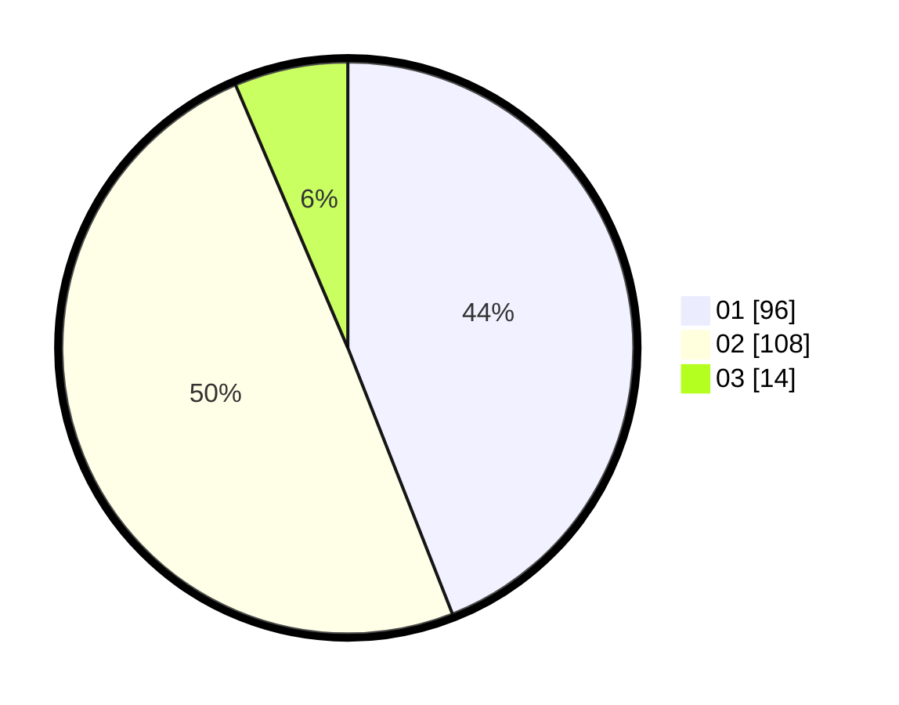

# Hasil

Hasil perolehan suara paslon dapat dilihat pada file paslon-01.txt, paslon-02.txt, dan paslon-03.txt.

Jika tidak ada, artinya data tersebut belum ada pada SIREKAP.

## Perolehan Suara

 * Paslon 01: **96**.
 * Paslon 02: **108**.
 * Paslon 03: **14**.

## Foto C Plano

https://sirekap-obj-formc.kpu.go.id/94ee/pemilu/ppwp/31/72/03/10/04/3172031004096-20240215-121031--62ae6985-549f-4a2c-8a34-6ed4fbcca8b2.jpg

https://sirekap-obj-formc.kpu.go.id/94ee/pemilu/ppwp/31/72/03/10/04/3172031004096-20240215-121053--59096c0b-62cc-49f6-b52f-be86864a8e3c.jpg

https://sirekap-obj-formc.kpu.go.id/94ee/pemilu/ppwp/31/72/03/10/04/3172031004096-20240215-121042--5293c543-e1b2-4f4b-9593-8f94b7c0936e.jpg

## DATA PEMILIH TETAP

Jumlah pemilih dalam DPT: **274**.
 * L: **140**.
 * P: **134**.

## DATA PENGGUNA HAK PILIH

Jumlah pengguna hak pilih dalam DPT: **222**.
 * L: **111**.
 * P: **111**.

Jumlah pengguna hak pilih dalam DPTb: **0**.
 * L: **0**.
 * P: **0**.

Jumlah pengguna hak pilih dalam DPK: **0**.
 * L: **0**.
 * P: **0**.

Jumlah pengguna hak pilih: **222**.
 * L: **111**.
 * P: **111**.

## JUMLAH SUARA SAH DAN TIDAK SAH

JUMLAH SELURUH SUARA SAH: **218**.

JUMLAH SUARA TIDAK SAH: **4**.

JUMLAH SELURUH SUARA SAH DAN SUARA TIDAK SAH: **222**.
