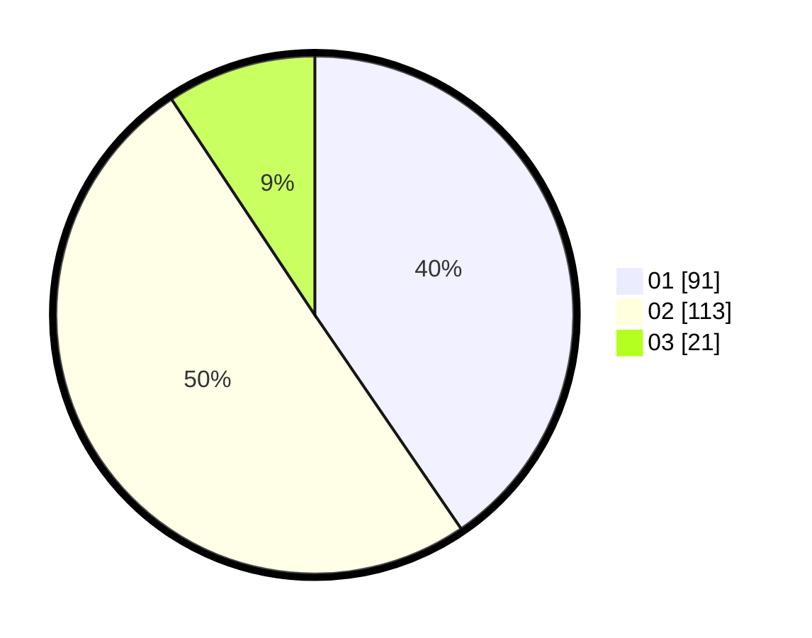

# Hasil

Hasil perolehan suara paslon dapat dilihat pada file paslon-01.txt, paslon-02.txt, dan paslon-03.txt.

Jika tidak ada, artinya data tersebut belum ada pada SIREKAP.

## Perolehan Suara

 * Paslon 01: **91**.
 * Paslon 02: **113**.
 * Paslon 03: **21**.

## Foto C Plano

https://sirekap-obj-formc.kpu.go.id/2d31/pemilu/ppwp/31/72/03/10/04/3172031004099-20240214-231628--b3f1e286-a376-4210-987d-cb2ffc83a4f3.jpg

https://sirekap-obj-formc.kpu.go.id/2d31/pemilu/ppwp/31/72/03/10/04/3172031004099-20240214-231657--9b6108e3-e246-4e88-b456-c7cc40297c14.jpg

https://sirekap-obj-formc.kpu.go.id/2d31/pemilu/ppwp/31/72/03/10/04/3172031004099-20240214-231753--431263ca-06a1-4509-8f42-d60eab3deabd.jpg

## DATA PEMILIH TETAP

Jumlah pemilih dalam DPT: **271**.
 * L: **131**.
 * P: **140**.

## DATA PENGGUNA HAK PILIH

Jumlah pengguna hak pilih dalam DPT: **228**.
 * L: **112**.
 * P: **116**.

Jumlah pengguna hak pilih dalam DPTb: **0**.
 * L: **0**.
 * P: **0**.

Jumlah pengguna hak pilih dalam DPK: **1**.
 * L: **1**.
 * P: **0**.

Jumlah pengguna hak pilih: **229**.
 * L: **113**.
 * P: **116**.

## JUMLAH SUARA SAH DAN TIDAK SAH

JUMLAH SELURUH SUARA SAH: **225**.

JUMLAH SUARA TIDAK SAH: **4**.

JUMLAH SELURUH SUARA SAH DAN SUARA TIDAK SAH: **229**.
