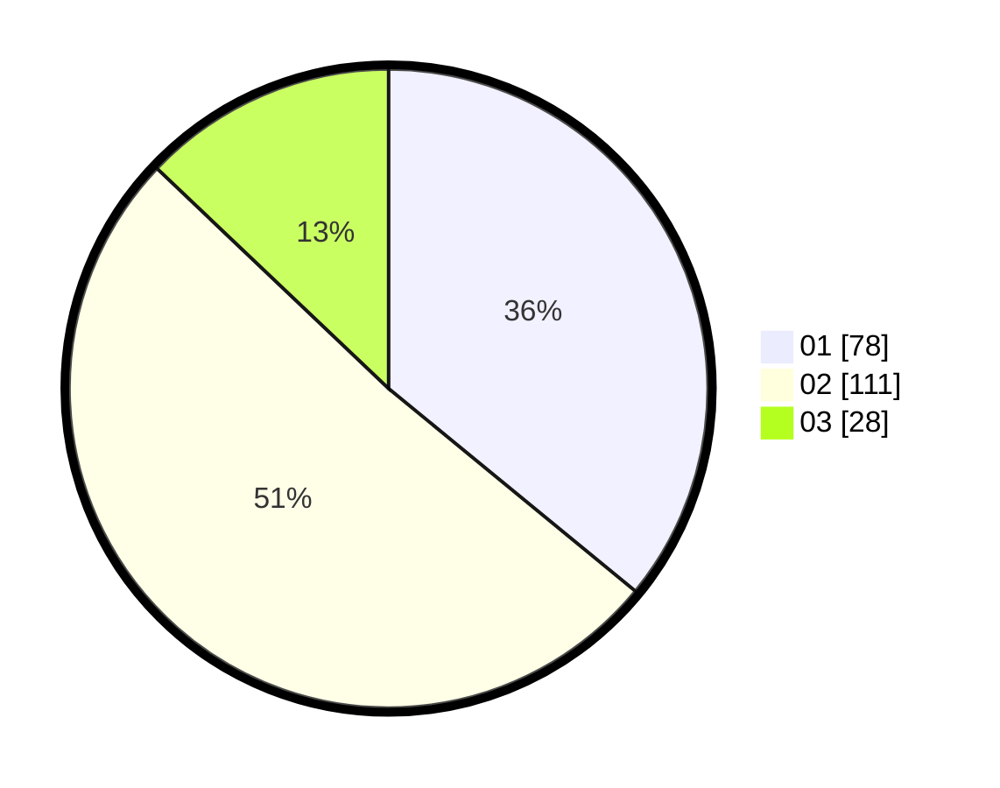

# Hasil

Hasil perolehan suara paslon dapat dilihat pada file paslon-01.txt, paslon-02.txt, dan paslon-03.txt.

Jika tidak ada, artinya data tersebut belum ada pada SIREKAP.

## Perolehan Suara

 * Paslon 01: **78**.
 * Paslon 02: **111**.
 * Paslon 03: **28**.

## Foto C Plano

https://sirekap-obj-formc.kpu.go.id/5337/pemilu/ppwp/31/72/03/10/04/3172031004100-20240216-160924--371cf591-fe6d-4256-944f-494f76fc05b9.jpg

https://sirekap-obj-formc.kpu.go.id/5337/pemilu/ppwp/31/72/03/10/04/3172031004100-20240216-160925--9456c8a7-cb08-4f90-8d21-60cf9ec420f0.jpg

https://sirekap-obj-formc.kpu.go.id/5337/pemilu/ppwp/31/72/03/10/04/3172031004100-20240216-160925--c1142b54-2aea-40bd-b0fd-9854926058c5.jpg

## DATA PEMILIH TETAP

Jumlah pemilih dalam DPT: **221**.
 * L: **103**.
 * P: **118**.

## DATA PENGGUNA HAK PILIH

Jumlah pengguna hak pilih dalam DPT: **219**.
 * L: **102**.
 * P: **117**.

Jumlah pengguna hak pilih dalam DPTb: **1**.
 * L: **1**.
 * P: **0**.

Jumlah pengguna hak pilih dalam DPK: **1**.
 * L: **0**.
 * P: **1**.

Jumlah pengguna hak pilih: **221**.
 * L: **103**.
 * P: **118**.

## JUMLAH SUARA SAH DAN TIDAK SAH

JUMLAH SELURUH SUARA SAH: **217**.

JUMLAH SUARA TIDAK SAH: **4**.

JUMLAH SELURUH SUARA SAH DAN SUARA TIDAK SAH: **221**.
