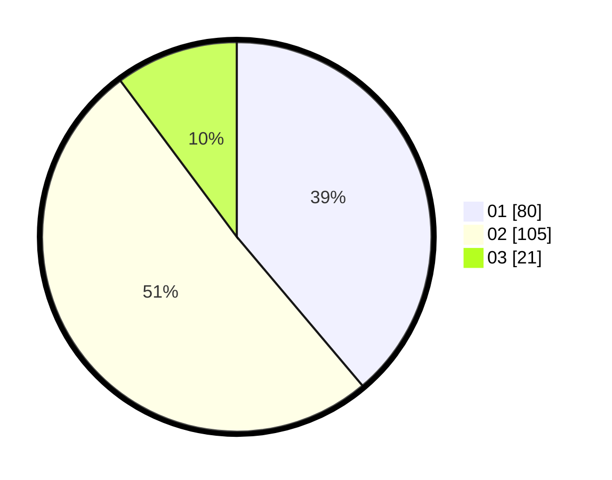

# Hasil

Hasil perolehan suara paslon dapat dilihat pada file paslon-01.txt, paslon-02.txt, dan paslon-03.txt.

Jika tidak ada, artinya data tersebut belum ada pada SIREKAP.

## Perolehan Suara

 * Paslon 01: **80**.
 * Paslon 02: **105**.
 * Paslon 03: **21**.

## Foto C Plano

https://sirekap-obj-formc.kpu.go.id/f56d/pemilu/ppwp/31/72/03/10/04/3172031004101-20240214-155821--41851a65-2fd9-4247-a4fb-3a6dac2a1806.jpg

https://sirekap-obj-formc.kpu.go.id/f56d/pemilu/ppwp/31/72/03/10/04/3172031004101-20240214-235125--af6fa776-6765-4d28-833d-d1e6f0fa112d.jpg

https://sirekap-obj-formc.kpu.go.id/f56d/pemilu/ppwp/31/72/03/10/04/3172031004101-20240214-235321--5eae9bab-225e-4ad2-aa69-27afe415bfc6.jpg

## DATA PEMILIH TETAP

Jumlah pemilih dalam DPT: **269**.
 * L: **135**.
 * P: **134**.

## DATA PENGGUNA HAK PILIH

Jumlah pengguna hak pilih dalam DPT: **205**.
 * L: **97**.
 * P: **108**.

Jumlah pengguna hak pilih dalam DPTb: **1**.
 * L: **1**.
 * P: **0**.

Jumlah pengguna hak pilih dalam DPK: **2**.
 * L: **1**.
 * P: **1**.

Jumlah pengguna hak pilih: **208**.
 * L: **99**.
 * P: **109**.

## JUMLAH SUARA SAH DAN TIDAK SAH

JUMLAH SELURUH SUARA SAH: **206**.

JUMLAH SUARA TIDAK SAH: **2**.

JUMLAH SELURUH SUARA SAH DAN SUARA TIDAK SAH: **208**.
