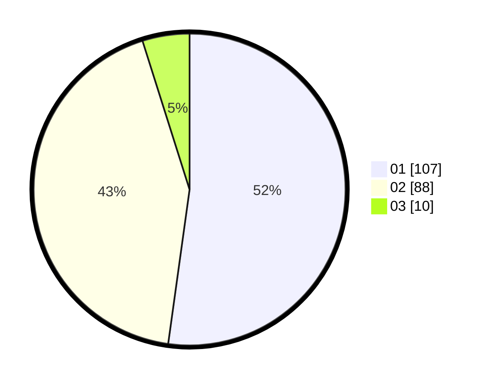

# Hasil

Hasil perolehan suara paslon dapat dilihat pada file paslon-01.txt, paslon-02.txt, dan paslon-03.txt.

Jika tidak ada, artinya data tersebut belum ada pada SIREKAP.

## Perolehan Suara

 * Paslon 01: **107**.
 * Paslon 02: **88**.
 * Paslon 03: **10**.

## Foto C Plano

https://sirekap-obj-formc.kpu.go.id/dade/pemilu/ppwp/31/72/03/10/04/3172031004102-20240216-183557--fecf5496-46ba-4f73-9fa2-a8e7ab2024e4.jpg

https://sirekap-obj-formc.kpu.go.id/dade/pemilu/ppwp/31/72/03/10/04/3172031004102-20240216-183558--6a07d4ba-6b2a-4429-9d45-a7cf9ec9ada5.jpg

https://sirekap-obj-formc.kpu.go.id/dade/pemilu/ppwp/31/72/03/10/04/3172031004102-20240216-183558--bb42d815-0447-4001-86ff-ee6db3fd9311.jpg

## DATA PEMILIH TETAP

Jumlah pemilih dalam DPT: **274**.
 * L: **138**.
 * P: **136**.

## DATA PENGGUNA HAK PILIH

Jumlah pengguna hak pilih dalam DPT: **202**.
 * L: **99**.
 * P: **103**.

Jumlah pengguna hak pilih dalam DPTb: **4**.
 * L: **1**.
 * P: **3**.

Jumlah pengguna hak pilih dalam DPK: **1**.
 * L: **1**.
 * P: **0**.

Jumlah pengguna hak pilih: **207**.
 * L: **101**.
 * P: **106**.

## JUMLAH SUARA SAH DAN TIDAK SAH

JUMLAH SELURUH SUARA SAH: **205**.

JUMLAH SUARA TIDAK SAH: **2**.

JUMLAH SELURUH SUARA SAH DAN SUARA TIDAK SAH: **207**.
