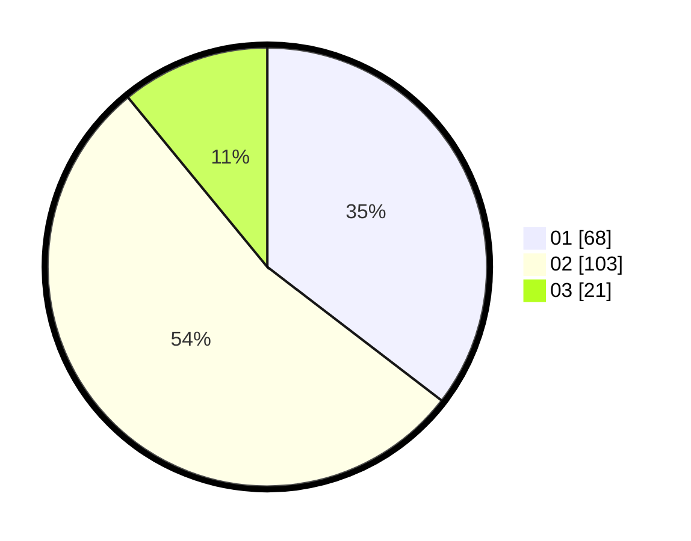

# Hasil

Hasil perolehan suara paslon dapat dilihat pada file paslon-01.txt, paslon-02.txt, dan paslon-03.txt.

Jika tidak ada, artinya data tersebut belum ada pada SIREKAP.

## Perolehan Suara

 * Paslon 01: **68**.
 * Paslon 02: **103**.
 * Paslon 03: **21**.

## Foto C Plano

https://sirekap-obj-formc.kpu.go.id/2017/pemilu/ppwp/31/72/03/10/04/3172031004104-20240215-213125--e20f1477-b0c8-4126-9f73-d02c130682d7.jpg

https://sirekap-obj-formc.kpu.go.id/2017/pemilu/ppwp/31/72/03/10/04/3172031004104-20240215-213127--d3a4cc06-c6fb-4924-9796-e8525ad1920f.jpg

https://sirekap-obj-formc.kpu.go.id/2017/pemilu/ppwp/31/72/03/10/04/3172031004104-20240215-213126--06aded04-5d24-4117-b4ca-f023cfda7623.jpg

## DATA PEMILIH TETAP

Jumlah pemilih dalam DPT: **291**.
 * L: **141**.
 * P: **150**.

## DATA PENGGUNA HAK PILIH

Jumlah pengguna hak pilih dalam DPT: **198**.
 * L: **93**.
 * P: **105**.

Jumlah pengguna hak pilih dalam DPTb: **0**.
 * L: **0**.
 * P: **0**.

Jumlah pengguna hak pilih dalam DPK: **0**.
 * L: **0**.
 * P: **0**.

Jumlah pengguna hak pilih: **198**.
 * L: **93**.
 * P: **105**.

## JUMLAH SUARA SAH DAN TIDAK SAH

JUMLAH SELURUH SUARA SAH: **192**.

JUMLAH SUARA TIDAK SAH: **6**.

JUMLAH SELURUH SUARA SAH DAN SUARA TIDAK SAH: **198**.
