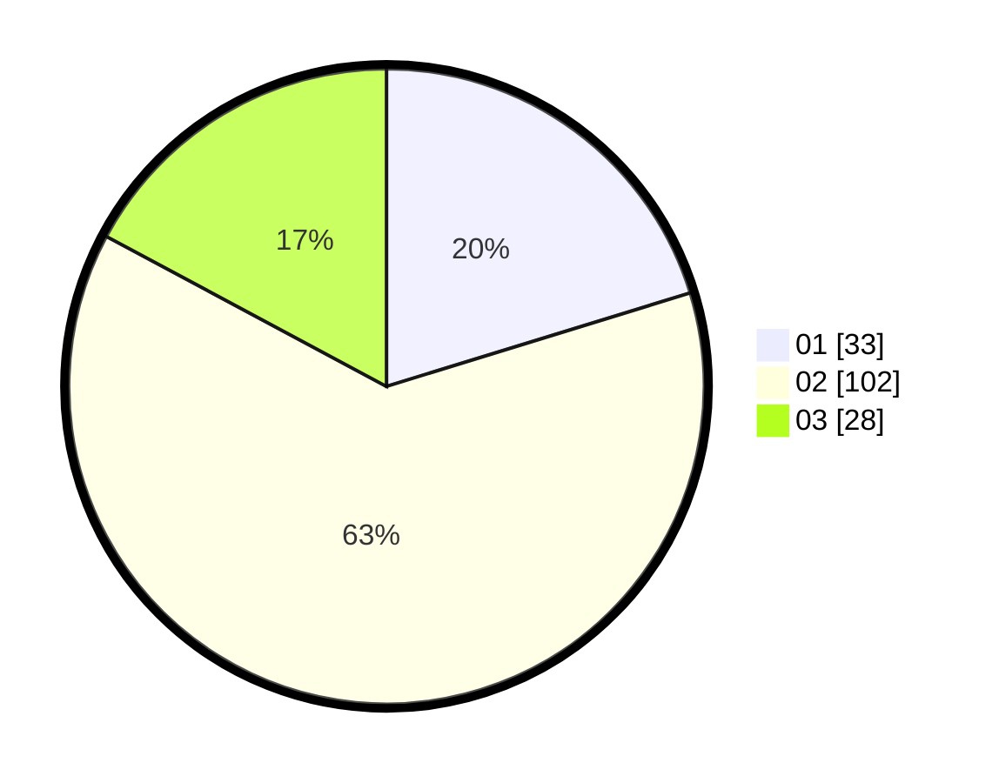

# Hasil

Hasil perolehan suara paslon dapat dilihat pada file paslon-01.txt, paslon-02.txt, dan paslon-03.txt.

Jika tidak ada, artinya data tersebut belum ada pada SIREKAP.

## Perolehan Suara

 * Paslon 01: **33**.
 * Paslon 02: **102**.
 * Paslon 03: **28**.

## Foto C Plano

https://sirekap-obj-formc.kpu.go.id/34f6/pemilu/ppwp/31/72/03/10/04/3172031004105-20240215-215234--19378585-1128-4bea-a96d-71f401c1cc83.jpg

https://sirekap-obj-formc.kpu.go.id/34f6/pemilu/ppwp/31/72/03/10/04/3172031004105-20240215-215236--80a9bb66-1174-4fca-8993-7f11acc83d44.jpg

https://sirekap-obj-formc.kpu.go.id/34f6/pemilu/ppwp/31/72/03/10/04/3172031004105-20240215-215235--ecc202bd-c7fd-461b-a861-437fbde4e29e.jpg

## DATA PEMILIH TETAP

Jumlah pemilih dalam DPT: **207**.
 * L: **95**.
 * P: **112**.

## DATA PENGGUNA HAK PILIH

Jumlah pengguna hak pilih dalam DPT: **142**.
 * L: **58**.
 * P: **84**.

Jumlah pengguna hak pilih dalam DPTb: **21**.
 * L: **20**.
 * P: **1**.

Jumlah pengguna hak pilih dalam DPK: **0**.
 * L: **0**.
 * P: **0**.

Jumlah pengguna hak pilih: **163**.
 * L: **78**.
 * P: **85**.

## JUMLAH SUARA SAH DAN TIDAK SAH

JUMLAH SELURUH SUARA SAH: **163**.

JUMLAH SUARA TIDAK SAH: **0**.

JUMLAH SELURUH SUARA SAH DAN SUARA TIDAK SAH: **163**.
