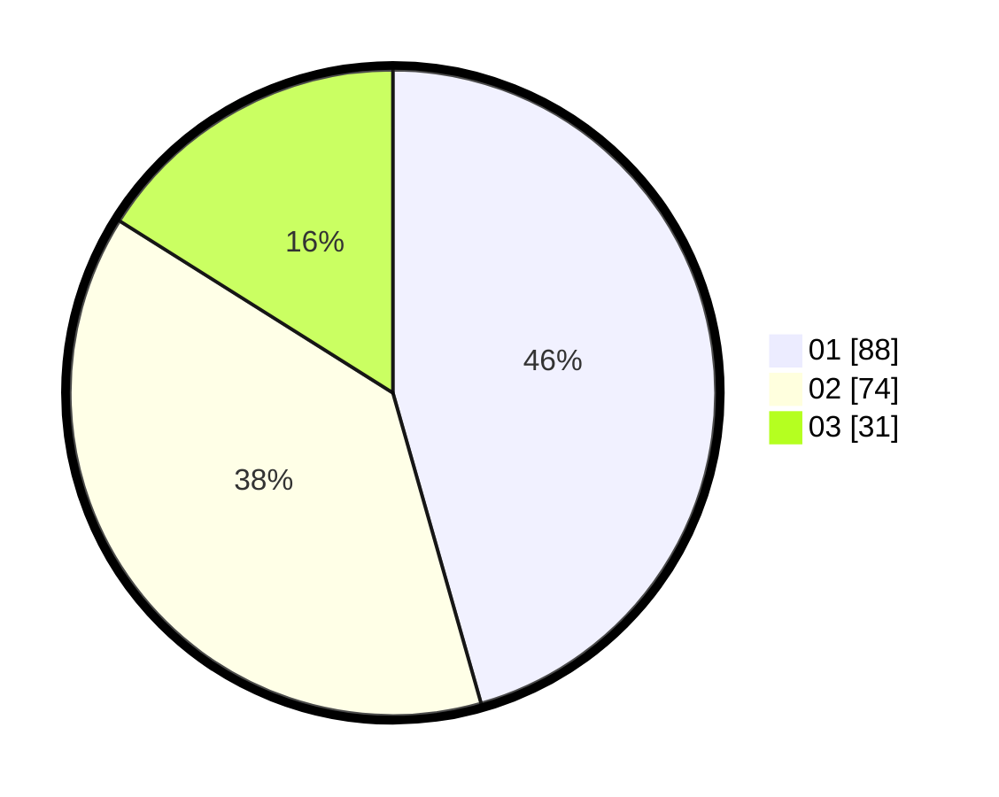

# Hasil

Hasil perolehan suara paslon dapat dilihat pada file paslon-01.txt, paslon-02.txt, dan paslon-03.txt.

Jika tidak ada, artinya data tersebut belum ada pada SIREKAP.

## Perolehan Suara

 * Paslon 01: **88**.
 * Paslon 02: **74**.
 * Paslon 03: **31**.

## Foto C Plano

https://sirekap-obj-formc.kpu.go.id/fbfe/pemilu/ppwp/31/72/03/10/04/3172031004111-20240214-155109--455431e0-94de-43a3-bc14-fd088d849d95.jpg

https://sirekap-obj-formc.kpu.go.id/fbfe/pemilu/ppwp/31/72/03/10/04/3172031004111-20240214-155524--04a25cdd-304b-4c77-9b3d-95cf893bf8a3.jpg

https://sirekap-obj-formc.kpu.go.id/fbfe/pemilu/ppwp/31/72/03/10/04/3172031004111-20240214-155216--a91da577-0674-4e6f-a994-7eb8e076ab63.jpg

## DATA PEMILIH TETAP

Jumlah pemilih dalam DPT: **232**.
 * L: **113**.
 * P: **119**.

## DATA PENGGUNA HAK PILIH

Jumlah pengguna hak pilih dalam DPT: **194**.
 * L: **88**.
 * P: **106**.

Jumlah pengguna hak pilih dalam DPTb: **8**.
 * L: **4**.
 * P: **4**.

Jumlah pengguna hak pilih dalam DPK: **1**.
 * L: **0**.
 * P: **1**.

Jumlah pengguna hak pilih: **203**.
 * L: **92**.
 * P: **111**.

## JUMLAH SUARA SAH DAN TIDAK SAH

JUMLAH SELURUH SUARA SAH: **193**.

JUMLAH SUARA TIDAK SAH: **1**.

JUMLAH SELURUH SUARA SAH DAN SUARA TIDAK SAH: **194**.
