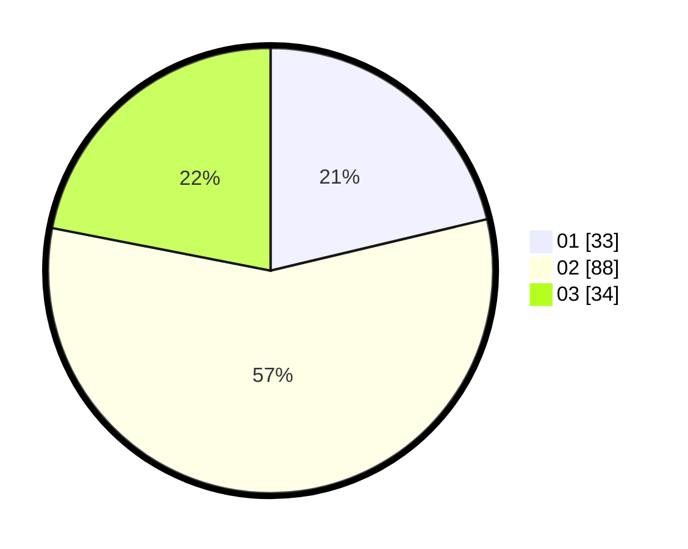

# Hasil

Hasil perolehan suara paslon dapat dilihat pada file paslon-01.txt, paslon-02.txt, dan paslon-03.txt.

Jika tidak ada, artinya data tersebut belum ada pada SIREKAP.

## Perolehan Suara

 * Paslon 01: **33**.
 * Paslon 02: **88**.
 * Paslon 03: **34**.

## Foto C Plano

https://sirekap-obj-formc.kpu.go.id/bad5/pemilu/ppwp/31/72/03/10/04/3172031004116-20240216-182408--5f325930-8a59-4f13-aec7-536fddf26f6a.jpg

https://sirekap-obj-formc.kpu.go.id/bad5/pemilu/ppwp/31/72/03/10/04/3172031004116-20240216-182410--2a1479e9-ff28-49a5-a196-f452d6d64320.jpg

https://sirekap-obj-formc.kpu.go.id/bad5/pemilu/ppwp/31/72/03/10/04/3172031004116-20240216-182409--ab9b7c7e-faa0-408d-af8c-a0f976ba1f4f.jpg

## DATA PEMILIH TETAP

Jumlah pemilih dalam DPT: **218**.
 * L: **97**.
 * P: **121**.

## DATA PENGGUNA HAK PILIH

Jumlah pengguna hak pilih dalam DPT: **153**.
 * L: **67**.
 * P: **86**.

Jumlah pengguna hak pilih dalam DPTb: **1**.
 * L: **0**.
 * P: **1**.

Jumlah pengguna hak pilih dalam DPK: **3**.
 * L: **1**.
 * P: **2**.

Jumlah pengguna hak pilih: **157**.
 * L: **68**.
 * P: **89**.

## JUMLAH SUARA SAH DAN TIDAK SAH

JUMLAH SELURUH SUARA SAH: **155**.

JUMLAH SUARA TIDAK SAH: **2**.

JUMLAH SELURUH SUARA SAH DAN SUARA TIDAK SAH: **157**.
