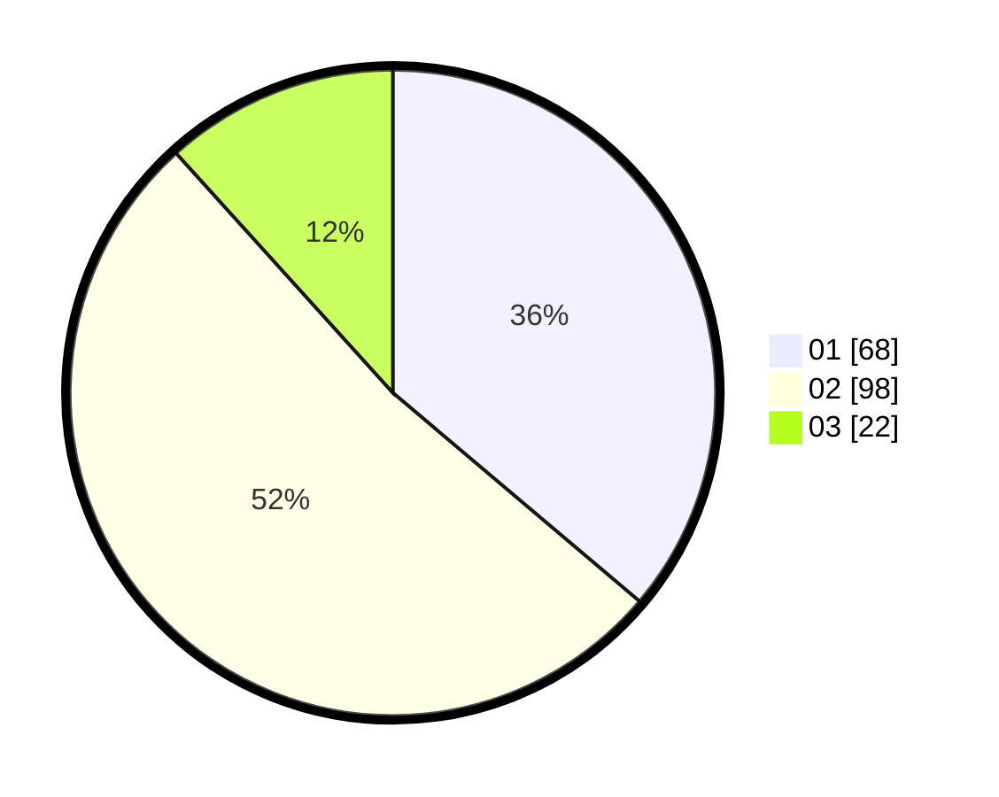

# Hasil

Hasil perolehan suara paslon dapat dilihat pada file paslon-01.txt, paslon-02.txt, dan paslon-03.txt.

Jika tidak ada, artinya data tersebut belum ada pada SIREKAP.

## Perolehan Suara

 * Paslon 01: **68**.
 * Paslon 02: **98**.
 * Paslon 03: **22**.

## Foto C Plano

https://sirekap-obj-formc.kpu.go.id/6205/pemilu/ppwp/31/72/03/10/05/3172031005004-20240214-184617--e4d3210c-e85a-4988-832b-76618e01f1dc.jpg

https://sirekap-obj-formc.kpu.go.id/6205/pemilu/ppwp/31/72/03/10/05/3172031005004-20240214-184647--7ba9931e-799f-43e7-bc84-2ebad5476830.jpg

https://sirekap-obj-formc.kpu.go.id/6205/pemilu/ppwp/31/72/03/10/05/3172031005004-20240214-213221--51834fd8-d51d-4585-80e8-ccfbfc107fa9.jpg

## DATA PEMILIH TETAP

Jumlah pemilih dalam DPT: **282**.
 * L: **156**.
 * P: **126**.

## DATA PENGGUNA HAK PILIH

Jumlah pengguna hak pilih dalam DPT: **193**.
 * L: **103**.
 * P: **90**.

Jumlah pengguna hak pilih dalam DPTb: **0**.
 * L: **0**.
 * P: **0**.

Jumlah pengguna hak pilih dalam DPK: **0**.
 * L: **0**.
 * P: **0**.

Jumlah pengguna hak pilih: **193**.
 * L: **103**.
 * P: **90**.

## JUMLAH SUARA SAH DAN TIDAK SAH

JUMLAH SELURUH SUARA SAH: **188**.

JUMLAH SUARA TIDAK SAH: **5**.

JUMLAH SELURUH SUARA SAH DAN SUARA TIDAK SAH: **193**.
