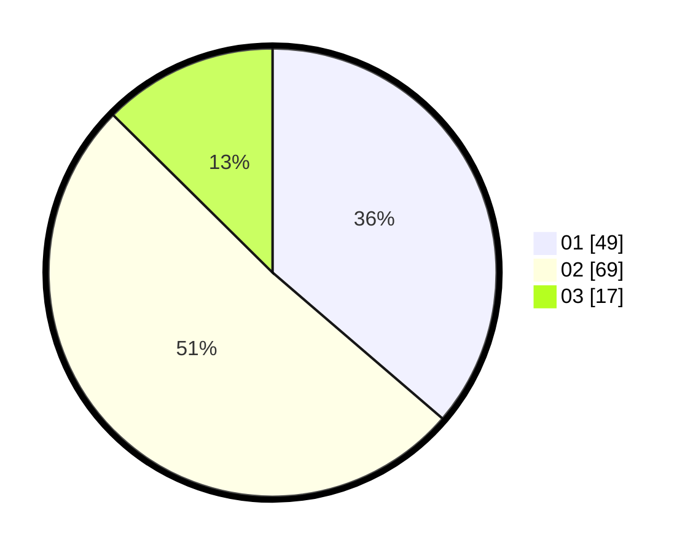

# Hasil

Hasil perolehan suara paslon dapat dilihat pada file paslon-01.txt, paslon-02.txt, dan paslon-03.txt.

Jika tidak ada, artinya data tersebut belum ada pada SIREKAP.

## Perolehan Suara

 * Paslon 01: **49**.
 * Paslon 02: **69**.
 * Paslon 03: **17**.

## Foto C Plano

https://sirekap-obj-formc.kpu.go.id/6483/pemilu/ppwp/31/72/03/10/05/3172031005009-20240214-185316--bc673197-90b2-417c-9474-91ef052fc3cb.jpg

https://sirekap-obj-formc.kpu.go.id/6483/pemilu/ppwp/31/72/03/10/05/3172031005009-20240214-185332--60d141ae-4cb9-422e-8206-c7adafc8fa1f.jpg

https://sirekap-obj-formc.kpu.go.id/6483/pemilu/ppwp/31/72/03/10/05/3172031005009-20240214-185337--a8de6d28-0d46-4c69-b3b7-758dd7ae8c71.jpg

## DATA PEMILIH TETAP

Jumlah pemilih dalam DPT: **196**.
 * L: **101**.
 * P: **95**.

## DATA PENGGUNA HAK PILIH

Jumlah pengguna hak pilih dalam DPT: **136**.
 * L: **64**.
 * P: **72**.

Jumlah pengguna hak pilih dalam DPTb: **0**.
 * L: **0**.
 * P: **0**.

Jumlah pengguna hak pilih dalam DPK: **0**.
 * L: **0**.
 * P: **0**.

Jumlah pengguna hak pilih: **136**.
 * L: **64**.
 * P: **72**.

## JUMLAH SUARA SAH DAN TIDAK SAH

JUMLAH SELURUH SUARA SAH: **135**.

JUMLAH SUARA TIDAK SAH: **1**.

JUMLAH SELURUH SUARA SAH DAN SUARA TIDAK SAH: **136**.
