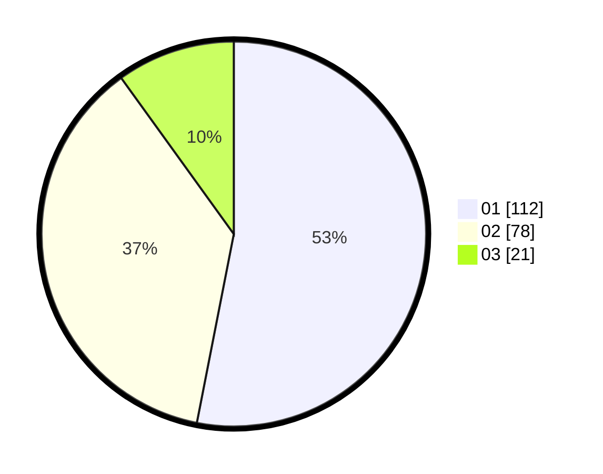

# Hasil

Hasil perolehan suara paslon dapat dilihat pada file paslon-01.txt, paslon-02.txt, dan paslon-03.txt.

Jika tidak ada, artinya data tersebut belum ada pada SIREKAP.

## Perolehan Suara

 * Paslon 01: **112**.
 * Paslon 02: **78**.
 * Paslon 03: **21**.

## Foto C Plano

https://sirekap-obj-formc.kpu.go.id/3878/pemilu/ppwp/31/72/03/10/05/3172031005031-20240215-003555--3f8a53e2-9783-4807-bd70-02df323ef27f.jpg

https://sirekap-obj-formc.kpu.go.id/3878/pemilu/ppwp/31/72/03/10/05/3172031005031-20240214-200754--9e117feb-1086-4016-9adc-76b7841aecf7.jpg

https://sirekap-obj-formc.kpu.go.id/3878/pemilu/ppwp/31/72/03/10/05/3172031005031-20240214-195546--30dd87a8-0610-48ee-95a4-163a894dcd5f.jpg

## DATA PEMILIH TETAP

Jumlah pemilih dalam DPT: **283**.
 * L: **146**.
 * P: **137**.

## DATA PENGGUNA HAK PILIH

Jumlah pengguna hak pilih dalam DPT: **210**.
 * L: **107**.
 * P: **103**.

Jumlah pengguna hak pilih dalam DPTb: **3**.
 * L: **2**.
 * P: **1**.

Jumlah pengguna hak pilih dalam DPK: **0**.
 * L: **0**.
 * P: **0**.

Jumlah pengguna hak pilih: **213**.
 * L: **109**.
 * P: **104**.

## JUMLAH SUARA SAH DAN TIDAK SAH

JUMLAH SELURUH SUARA SAH: **211**.

JUMLAH SUARA TIDAK SAH: **2**.

JUMLAH SELURUH SUARA SAH DAN SUARA TIDAK SAH: **213**.
