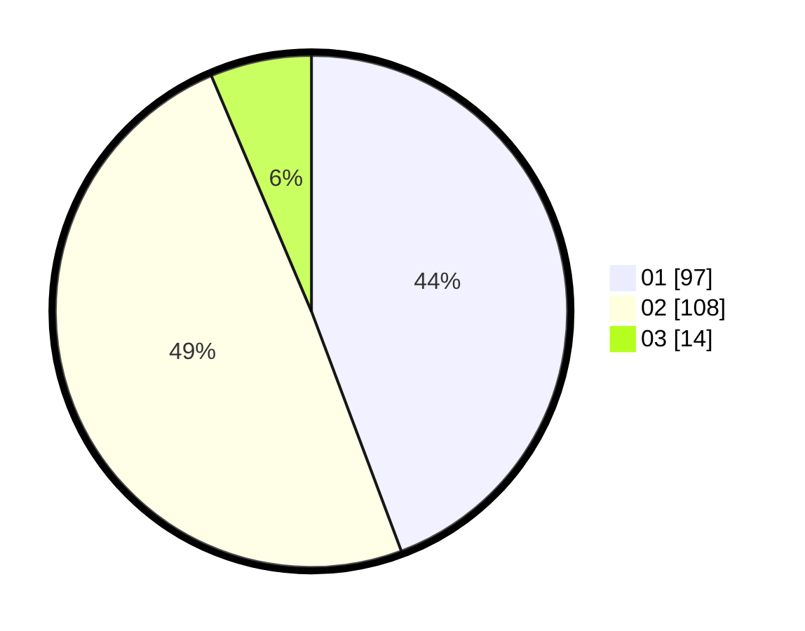

# Hasil

Hasil perolehan suara paslon dapat dilihat pada file paslon-01.txt, paslon-02.txt, dan paslon-03.txt.

Jika tidak ada, artinya data tersebut belum ada pada SIREKAP.

## Perolehan Suara

 * Paslon 01: **97**.
 * Paslon 02: **108**.
 * Paslon 03: **14**.

## Foto C Plano

https://sirekap-obj-formc.kpu.go.id/bbeb/pemilu/ppwp/31/72/03/10/05/3172031005040-20240219-155737--5b0cf4ba-ea53-43be-8152-12adf8db336f.jpg

https://sirekap-obj-formc.kpu.go.id/bbeb/pemilu/ppwp/31/72/03/10/05/3172031005040-20240219-142157--97dd5d66-c696-4ff0-b8b3-f2ed52b0825e.jpg

https://sirekap-obj-formc.kpu.go.id/bbeb/pemilu/ppwp/31/72/03/10/05/3172031005040-20240219-142340--bfec82e6-266f-40f5-87e6-b577c4653b0a.jpg
