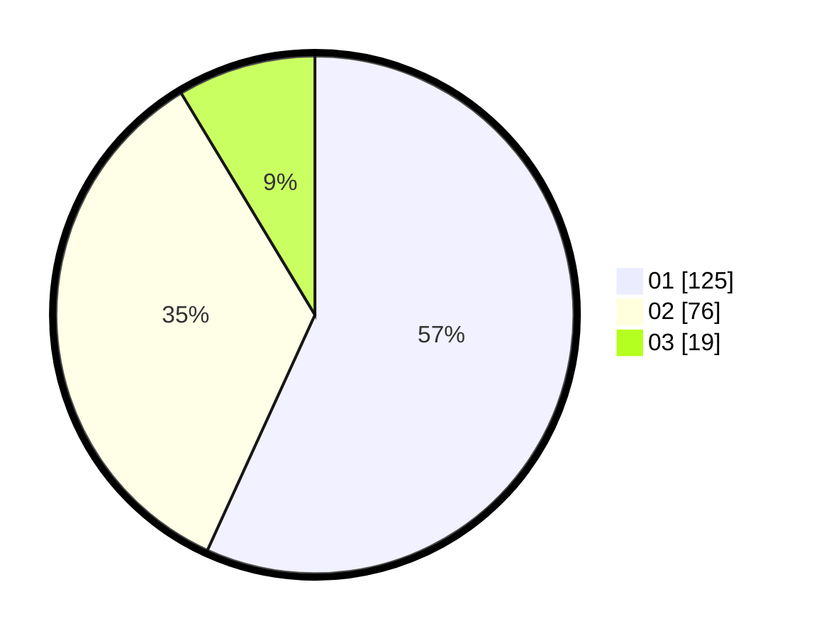

# Hasil

Hasil perolehan suara paslon dapat dilihat pada file paslon-01.txt, paslon-02.txt, dan paslon-03.txt.

Jika tidak ada, artinya data tersebut belum ada pada SIREKAP.

## Perolehan Suara

 * Paslon 01: **125**.
 * Paslon 02: **76**.
 * Paslon 03: **19**.

## Foto C Plano

https://sirekap-obj-formc.kpu.go.id/6f96/pemilu/ppwp/31/72/03/10/05/3172031005042-20240216-015020--044180bd-ccf3-4589-aed8-e4ad0782bf4d.jpg

https://sirekap-obj-formc.kpu.go.id/6f96/pemilu/ppwp/31/72/03/10/05/3172031005042-20240216-015035--747959b3-ea54-4014-8c9e-9e7dca771eb9.jpg

https://sirekap-obj-formc.kpu.go.id/6f96/pemilu/ppwp/31/72/03/10/05/3172031005042-20240216-015028--1cf58da0-65a8-49a2-9a0b-3516daf42a1f.jpg

## DATA PEMILIH TETAP

Jumlah pemilih dalam DPT: **299**.
 * L: **154**.
 * P: **145**.

## DATA PENGGUNA HAK PILIH

Jumlah pengguna hak pilih dalam DPT: **219**.
 * L: **104**.
 * P: **115**.

Jumlah pengguna hak pilih dalam DPTb: **4**.
 * L: **3**.
 * P: **1**.

Jumlah pengguna hak pilih dalam DPK: **2**.
 * L: **0**.
 * P: **2**.

Jumlah pengguna hak pilih: **225**.
 * L: **107**.
 * P: **118**.

## JUMLAH SUARA SAH DAN TIDAK SAH

JUMLAH SELURUH SUARA SAH: **220**.

JUMLAH SUARA TIDAK SAH: **5**.

JUMLAH SELURUH SUARA SAH DAN SUARA TIDAK SAH: **225**.
