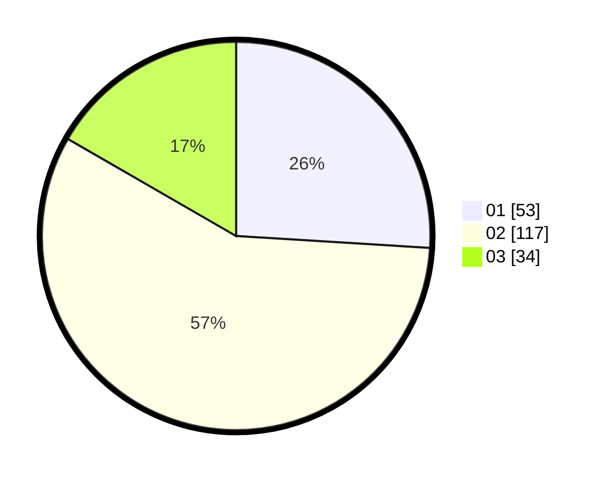

# Hasil

Hasil perolehan suara paslon dapat dilihat pada file paslon-01.txt, paslon-02.txt, dan paslon-03.txt.

Jika tidak ada, artinya data tersebut belum ada pada SIREKAP.

## Perolehan Suara

 * Paslon 01: **53**.
 * Paslon 02: **117**.
 * Paslon 03: **34**.

## Foto C Plano

https://sirekap-obj-formc.kpu.go.id/ad91/pemilu/ppwp/31/72/03/10/05/3172031005052-20240214-193941--342ad021-e248-46b3-8114-5d142b4ec509.jpg

https://sirekap-obj-formc.kpu.go.id/ad91/pemilu/ppwp/31/72/03/10/05/3172031005052-20240214-194003--e18a54ec-1273-4a09-9ca0-8de3fca5eed3.jpg

https://sirekap-obj-formc.kpu.go.id/ad91/pemilu/ppwp/31/72/03/10/05/3172031005052-20240214-194019--7b153ec7-3083-43d6-a8d3-13e8d050ae59.jpg

## DATA PEMILIH TETAP

Jumlah pemilih dalam DPT: **285**.
 * L: **43**.
 * P: **192**.

## DATA PENGGUNA HAK PILIH

Jumlah pengguna hak pilih dalam DPT: **207**.
 * L: **0**.
 * P: **0**.

Jumlah pengguna hak pilih dalam DPTb: **0**.
 * L: **0**.
 * P: **0**.

Jumlah pengguna hak pilih dalam DPK: **0**.
 * L: **0**.
 * P: **0**.

Jumlah pengguna hak pilih: **207**.
 * L: **0**.
 * P: **0**.

## JUMLAH SUARA SAH DAN TIDAK SAH

JUMLAH SELURUH SUARA SAH: **204**.

JUMLAH SUARA TIDAK SAH: **3**.

JUMLAH SELURUH SUARA SAH DAN SUARA TIDAK SAH: **207**.
