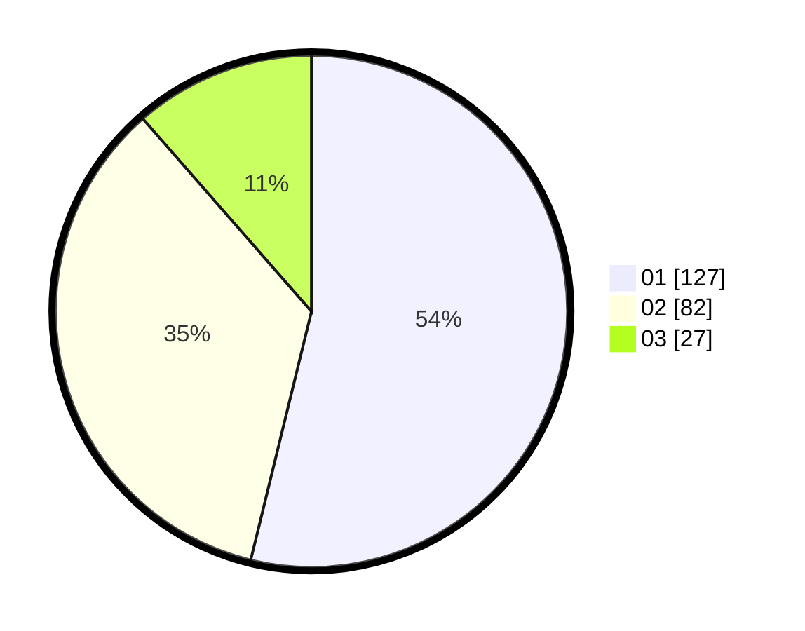

# Hasil

Hasil perolehan suara paslon dapat dilihat pada file paslon-01.txt, paslon-02.txt, dan paslon-03.txt.

Jika tidak ada, artinya data tersebut belum ada pada SIREKAP.

## Perolehan Suara

 * Paslon 01: **127**.
 * Paslon 02: **82**.
 * Paslon 03: **27**.

## Foto C Plano

https://sirekap-obj-formc.kpu.go.id/fcfd/pemilu/ppwp/31/72/03/10/05/3172031005054-20240217-121432--0971ca0d-80a4-4dd3-a703-0e583f827d1d.jpg

https://sirekap-obj-formc.kpu.go.id/fcfd/pemilu/ppwp/31/72/03/10/05/3172031005054-20240217-121848--226c2cbf-4fc3-4f4f-875e-ae05d9e395e7.jpg

https://sirekap-obj-formc.kpu.go.id/fcfd/pemilu/ppwp/31/72/03/10/05/3172031005054-20240217-120210--ca352088-f096-41e9-a3cd-4b7610f0ddbe.jpg

## DATA PEMILIH TETAP

Jumlah pemilih dalam DPT: **289**.
 * L: **148**.
 * P: **141**.

## DATA PENGGUNA HAK PILIH

Jumlah pengguna hak pilih dalam DPT: **231**.
 * L: **120**.
 * P: **111**.

Jumlah pengguna hak pilih dalam DPTb: **6**.
 * L: **3**.
 * P: **3**.

Jumlah pengguna hak pilih dalam DPK: **0**.
 * L: **0**.
 * P: **0**.

Jumlah pengguna hak pilih: **237**.
 * L: **123**.
 * P: **114**.

## JUMLAH SUARA SAH DAN TIDAK SAH

JUMLAH SELURUH SUARA SAH: **236**.

JUMLAH SUARA TIDAK SAH: **1**.

JUMLAH SELURUH SUARA SAH DAN SUARA TIDAK SAH: **237**.
