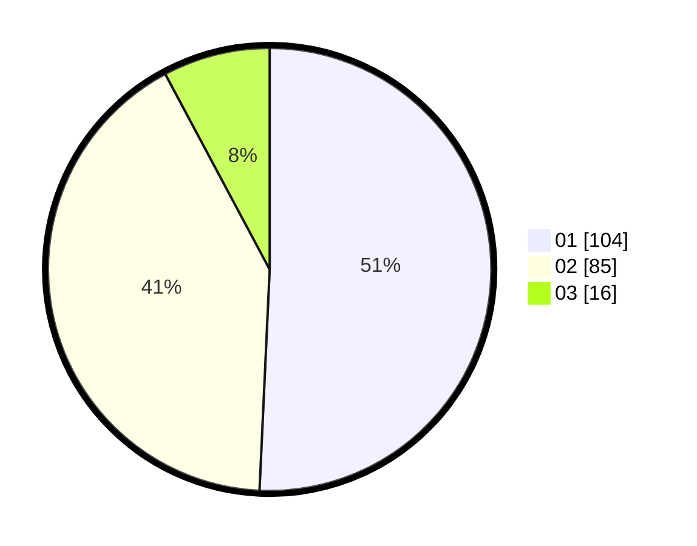

# Hasil

Hasil perolehan suara paslon dapat dilihat pada file paslon-01.txt, paslon-02.txt, dan paslon-03.txt.

Jika tidak ada, artinya data tersebut belum ada pada SIREKAP.

## Perolehan Suara

 * Paslon 01: **104**.
 * Paslon 02: **85**.
 * Paslon 03: **16**.

## Foto C Plano

https://sirekap-obj-formc.kpu.go.id/7077/pemilu/ppwp/31/72/03/10/05/3172031005065-20240215-002506--79b87af0-c082-4a87-a0a2-ec093ed33571.jpg

https://sirekap-obj-formc.kpu.go.id/7077/pemilu/ppwp/31/72/03/10/05/3172031005065-20240215-002537--740ce79c-2a86-426b-85df-972d0924b4b6.jpg

https://sirekap-obj-formc.kpu.go.id/7077/pemilu/ppwp/31/72/03/10/05/3172031005065-20240215-002609--117209af-769d-49dd-9954-5378bad3a57f.jpg
