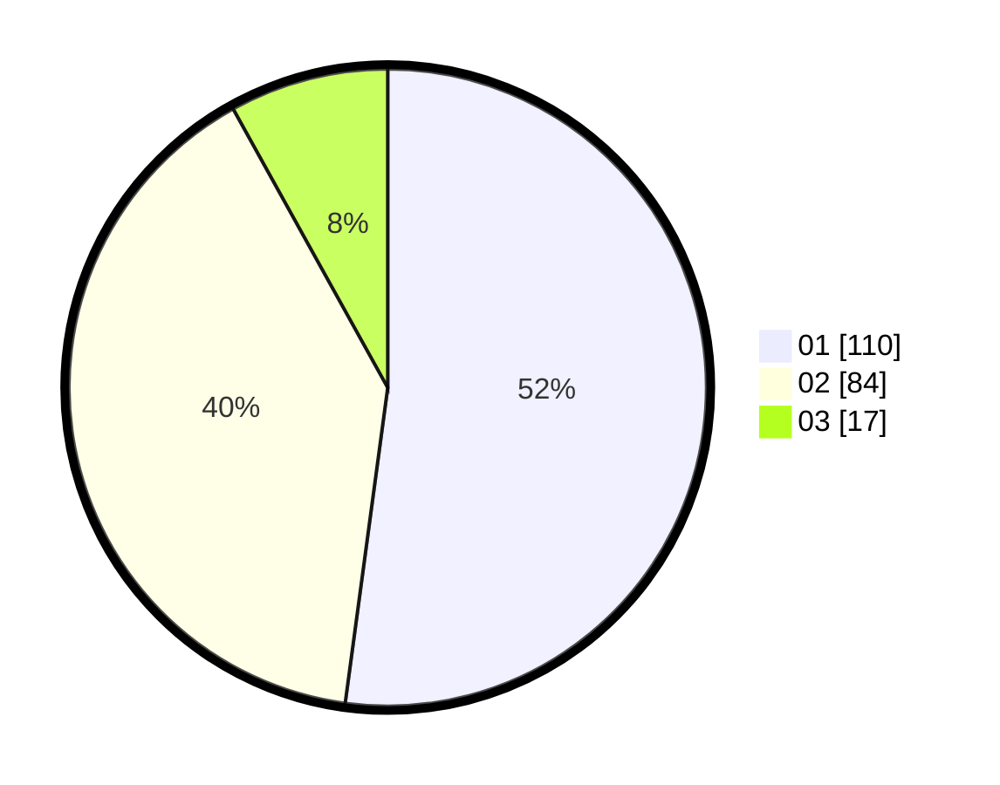

# Hasil

Hasil perolehan suara paslon dapat dilihat pada file paslon-01.txt, paslon-02.txt, dan paslon-03.txt.

Jika tidak ada, artinya data tersebut belum ada pada SIREKAP.

## Perolehan Suara

 * Paslon 01: **110**.
 * Paslon 02: **84**.
 * Paslon 03: **17**.

## Foto C Plano

https://sirekap-obj-formc.kpu.go.id/4add/pemilu/ppwp/31/72/03/10/05/3172031005067-20240216-163858--41ba3186-0b11-49a6-8098-688298ff0b95.jpg

https://sirekap-obj-formc.kpu.go.id/4add/pemilu/ppwp/31/72/03/10/05/3172031005067-20240216-163859--124e75b8-1ea5-4ae2-97ce-caaec2c53a20.jpg

https://sirekap-obj-formc.kpu.go.id/4add/pemilu/ppwp/31/72/03/10/05/3172031005067-20240216-163858--ee58589a-0412-4281-8a5d-76f6566287c0.jpg

## DATA PEMILIH TETAP

Jumlah pemilih dalam DPT: **282**.
 * L: **136**.
 * P: **146**.

## DATA PENGGUNA HAK PILIH

Jumlah pengguna hak pilih dalam DPT: **211**.
 * L: **100**.
 * P: **111**.

Jumlah pengguna hak pilih dalam DPTb: **0**.
 * L: **0**.
 * P: **0**.

Jumlah pengguna hak pilih dalam DPK: **2**.
 * L: **1**.
 * P: **1**.

Jumlah pengguna hak pilih: **213**.
 * L: **101**.
 * P: **112**.

## JUMLAH SUARA SAH DAN TIDAK SAH

JUMLAH SELURUH SUARA SAH: **211**.

JUMLAH SUARA TIDAK SAH: **2**.

JUMLAH SELURUH SUARA SAH DAN SUARA TIDAK SAH: **213**.
