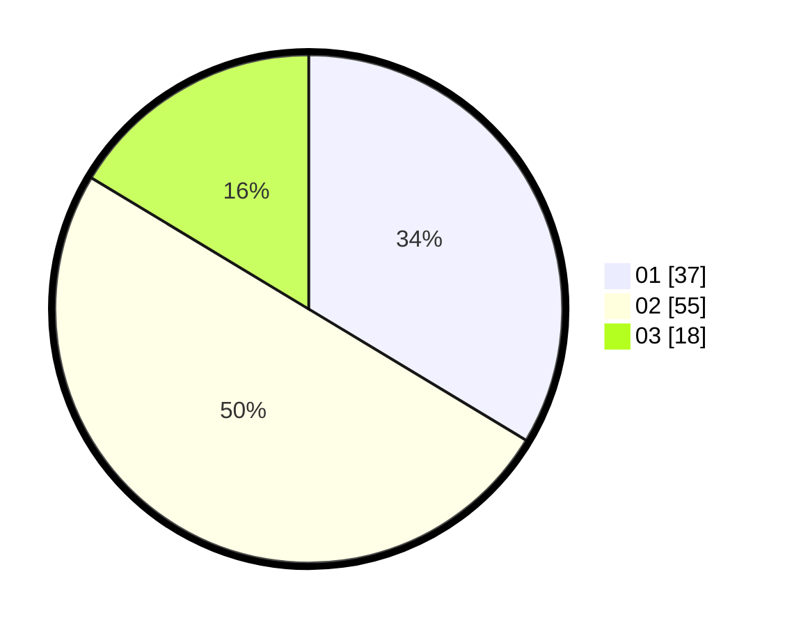

# Hasil

Hasil perolehan suara paslon dapat dilihat pada file paslon-01.txt, paslon-02.txt, dan paslon-03.txt.

Jika tidak ada, artinya data tersebut belum ada pada SIREKAP.

## Perolehan Suara

 * Paslon 01: **37**.
 * Paslon 02: **55**.
 * Paslon 03: **18**.

## Foto C Plano

https://sirekap-obj-formc.kpu.go.id/7356/pemilu/ppwp/31/72/03/10/05/3172031005070-20240214-193358--d5da9492-19dd-492e-b4e6-c970a1333109.jpg

https://sirekap-obj-formc.kpu.go.id/7356/pemilu/ppwp/31/72/03/10/05/3172031005070-20240214-193411--f4c6e535-d77d-466b-adaf-d4fd35c74d0c.jpg

https://sirekap-obj-formc.kpu.go.id/7356/pemilu/ppwp/31/72/03/10/05/3172031005070-20240216-144650--e043a6a1-d7d4-4f87-84e6-ceb64ae6d074.jpg

## DATA PEMILIH TETAP

Jumlah pemilih dalam DPT: **155**.
 * L: **76**.
 * P: **79**.

## DATA PENGGUNA HAK PILIH

Jumlah pengguna hak pilih dalam DPT: **109**.
 * L: **53**.
 * P: **56**.

Jumlah pengguna hak pilih dalam DPTb: **0**.
 * L: **0**.
 * P: **0**.

Jumlah pengguna hak pilih dalam DPK: **1**.
 * L: **0**.
 * P: **1**.

Jumlah pengguna hak pilih: **110**.
 * L: **53**.
 * P: **57**.

## JUMLAH SUARA SAH DAN TIDAK SAH

JUMLAH SELURUH SUARA SAH: **110**.

JUMLAH SUARA TIDAK SAH: **0**.

JUMLAH SELURUH SUARA SAH DAN SUARA TIDAK SAH: **110**.
