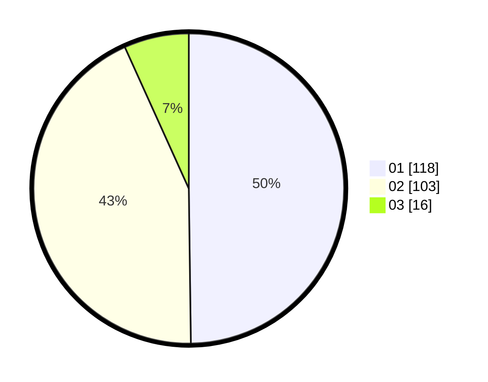

# Hasil

Hasil perolehan suara paslon dapat dilihat pada file paslon-01.txt, paslon-02.txt, dan paslon-03.txt.

Jika tidak ada, artinya data tersebut belum ada pada SIREKAP.

## Perolehan Suara

 * Paslon 01: **118**.
 * Paslon 02: **103**.
 * Paslon 03: **16**.

## Foto C Plano

https://sirekap-obj-formc.kpu.go.id/bca0/pemilu/ppwp/31/72/03/10/05/3172031005076-20240214-232946--dcd86886-4404-4f04-a48b-ebb2eab4b040.jpg

https://sirekap-obj-formc.kpu.go.id/bca0/pemilu/ppwp/31/72/03/10/05/3172031005076-20240214-233036--02da0569-281f-4d35-a048-2dd271793e29.jpg

https://sirekap-obj-formc.kpu.go.id/bca0/pemilu/ppwp/31/72/03/10/05/3172031005076-20240214-233047--38a00208-b913-45b7-836e-3d73803c6a44.jpg
