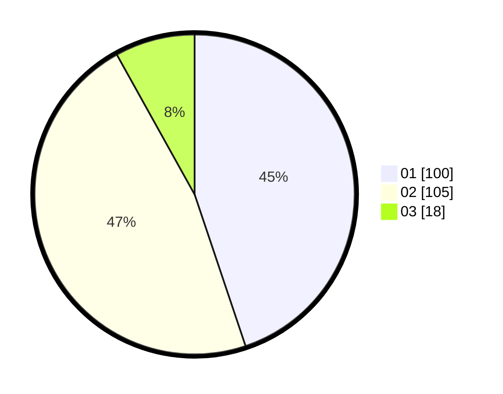

# Hasil

Hasil perolehan suara paslon dapat dilihat pada file paslon-01.txt, paslon-02.txt, dan paslon-03.txt.

Jika tidak ada, artinya data tersebut belum ada pada SIREKAP.

## Perolehan Suara

 * Paslon 01: **100**.
 * Paslon 02: **105**.
 * Paslon 03: **18**.

## Foto C Plano

https://sirekap-obj-formc.kpu.go.id/6e33/pemilu/ppwp/31/72/03/10/05/3172031005080-20240216-170925--85113cab-2f82-4460-80bc-c60a959db667.jpg

https://sirekap-obj-formc.kpu.go.id/6e33/pemilu/ppwp/31/72/03/10/05/3172031005080-20240216-170647--94c11160-3edf-4a1e-8185-b60ad2ca5b98.jpg

https://sirekap-obj-formc.kpu.go.id/6e33/pemilu/ppwp/31/72/03/10/05/3172031005080-20240216-170721--ad93740a-10d2-411d-b981-c17b1492a612.jpg

## DATA PEMILIH TETAP

Jumlah pemilih dalam DPT: **291**.
 * L: **136**.
 * P: **155**.

## DATA PENGGUNA HAK PILIH

Jumlah pengguna hak pilih dalam DPT: **228**.
 * L: **104**.
 * P: **124**.

Jumlah pengguna hak pilih dalam DPTb: **1**.
 * L: **1**.
 * P: **0**.

Jumlah pengguna hak pilih dalam DPK: **0**.
 * L: **0**.
 * P: **0**.

Jumlah pengguna hak pilih: **229**.
 * L: **105**.
 * P: **124**.

## JUMLAH SUARA SAH DAN TIDAK SAH

JUMLAH SELURUH SUARA SAH: **223**.

JUMLAH SUARA TIDAK SAH: **6**.

JUMLAH SELURUH SUARA SAH DAN SUARA TIDAK SAH: **229**.
