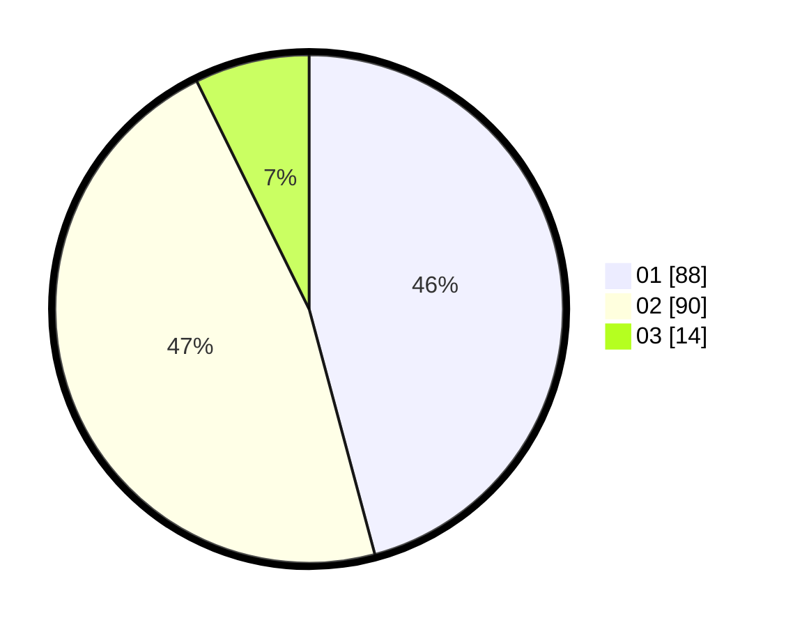

# Hasil

Hasil perolehan suara paslon dapat dilihat pada file paslon-01.txt, paslon-02.txt, dan paslon-03.txt.

Jika tidak ada, artinya data tersebut belum ada pada SIREKAP.

## Perolehan Suara

 * Paslon 01: **88**.
 * Paslon 02: **90**.
 * Paslon 03: **14**.

## Foto C Plano

https://sirekap-obj-formc.kpu.go.id/abb4/pemilu/ppwp/31/72/03/10/05/3172031005085-20240214-155616--9938a067-05da-4712-9b26-dd685d06dcbb.jpg

https://sirekap-obj-formc.kpu.go.id/abb4/pemilu/ppwp/31/72/03/10/05/3172031005085-20240214-155641--d1564be5-5767-4a1e-a876-342b1d0f4afd.jpg

https://sirekap-obj-formc.kpu.go.id/abb4/pemilu/ppwp/31/72/03/10/05/3172031005085-20240214-155648--e60f3fab-ac48-44c0-a3da-da8fe643bc8f.jpg

## DATA PEMILIH TETAP

Jumlah pemilih dalam DPT: **289**.
 * L: **141**.
 * P: **148**.

## DATA PENGGUNA HAK PILIH

Jumlah pengguna hak pilih dalam DPT: **191**.
 * L: **86**.
 * P: **105**.

Jumlah pengguna hak pilih dalam DPTb: **2**.
 * L: **1**.
 * P: **1**.

Jumlah pengguna hak pilih dalam DPK: **1**.
 * L: **1**.
 * P: **0**.

Jumlah pengguna hak pilih: **194**.
 * L: **88**.
 * P: **106**.

## JUMLAH SUARA SAH DAN TIDAK SAH

JUMLAH SELURUH SUARA SAH: **192**.

JUMLAH SUARA TIDAK SAH: **2**.

JUMLAH SELURUH SUARA SAH DAN SUARA TIDAK SAH: **194**.
