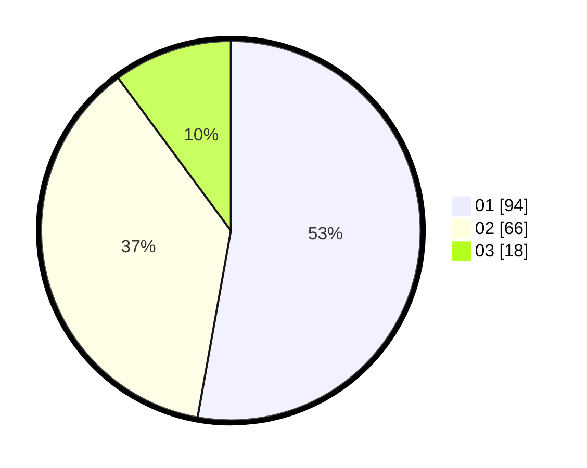

# Hasil

Hasil perolehan suara paslon dapat dilihat pada file paslon-01.txt, paslon-02.txt, dan paslon-03.txt.

Jika tidak ada, artinya data tersebut belum ada pada SIREKAP.

## Perolehan Suara

 * Paslon 01: **94**.
 * Paslon 02: **66**.
 * Paslon 03: **18**.

## Foto C Plano

https://sirekap-obj-formc.kpu.go.id/00a7/pemilu/ppwp/31/72/03/10/05/3172031005091-20240214-184742--10b0adae-51d5-4387-8bfa-9f953e91c7b6.jpg

https://sirekap-obj-formc.kpu.go.id/00a7/pemilu/ppwp/31/72/03/10/05/3172031005091-20240214-185002--0f49c475-f1b3-4ef0-8834-98eef1bae866.jpg

https://sirekap-obj-formc.kpu.go.id/00a7/pemilu/ppwp/31/72/03/10/05/3172031005091-20240214-185223--a63d4c5f-9d4a-4ca9-80b2-5cc9f276e073.jpg

## DATA PEMILIH TETAP

Jumlah pemilih dalam DPT: **256**.
 * L: **123**.
 * P: **133**.

## DATA PENGGUNA HAK PILIH

Jumlah pengguna hak pilih dalam DPT: **185**.
 * L: **80**.
 * P: **105**.

Jumlah pengguna hak pilih dalam DPTb: **0**.
 * L: **0**.
 * P: **0**.

Jumlah pengguna hak pilih dalam DPK: **0**.
 * L: **0**.
 * P: **0**.

Jumlah pengguna hak pilih: **185**.
 * L: **80**.
 * P: **105**.

## JUMLAH SUARA SAH DAN TIDAK SAH

JUMLAH SELURUH SUARA SAH: **178**.

JUMLAH SUARA TIDAK SAH: **7**.

JUMLAH SELURUH SUARA SAH DAN SUARA TIDAK SAH: **185**.
