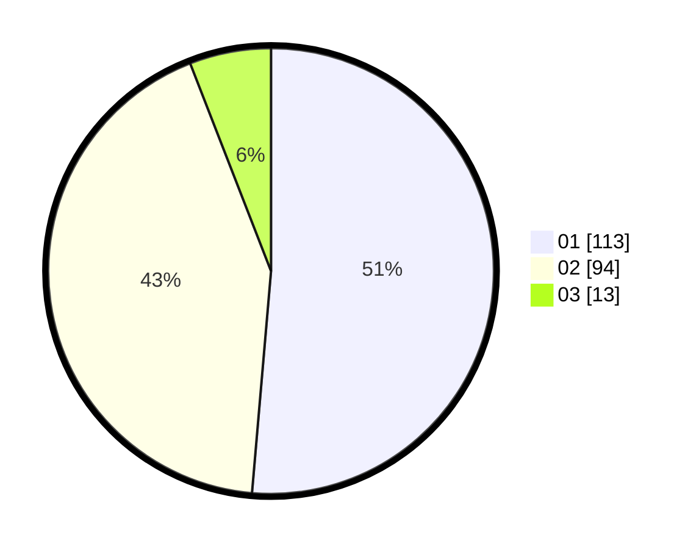

# Hasil

Hasil perolehan suara paslon dapat dilihat pada file paslon-01.txt, paslon-02.txt, dan paslon-03.txt.

Jika tidak ada, artinya data tersebut belum ada pada SIREKAP.

## Perolehan Suara

 * Paslon 01: **113**.
 * Paslon 02: **94**.
 * Paslon 03: **13**.

## Foto C Plano

https://sirekap-obj-formc.kpu.go.id/00ff/pemilu/ppwp/31/72/03/10/05/3172031005095-20240214-211035--d3689b0a-6119-4759-aa22-43b71857f8dd.jpg

https://sirekap-obj-formc.kpu.go.id/00ff/pemilu/ppwp/31/72/03/10/05/3172031005095-20240214-211044--081a4a91-14b8-44f4-b589-649aa8672756.jpg

https://sirekap-obj-formc.kpu.go.id/00ff/pemilu/ppwp/31/72/03/10/05/3172031005095-20240214-211053--4871b930-a1fe-49f2-a4e2-9f5d352dfbd3.jpg

## DATA PEMILIH TETAP

Jumlah pemilih dalam DPT: **288**.
 * L: **149**.
 * P: **139**.

## DATA PENGGUNA HAK PILIH

Jumlah pengguna hak pilih dalam DPT: **221**.
 * L: **107**.
 * P: **114**.

Jumlah pengguna hak pilih dalam DPTb: **3**.
 * L: **0**.
 * P: **3**.

Jumlah pengguna hak pilih dalam DPK: **0**.
 * L: **0**.
 * P: **0**.

Jumlah pengguna hak pilih: **224**.
 * L: **108**.
 * P: **116**.

## JUMLAH SUARA SAH DAN TIDAK SAH

JUMLAH SELURUH SUARA SAH: **220**.

JUMLAH SUARA TIDAK SAH: **4**.

JUMLAH SELURUH SUARA SAH DAN SUARA TIDAK SAH: **224**.
