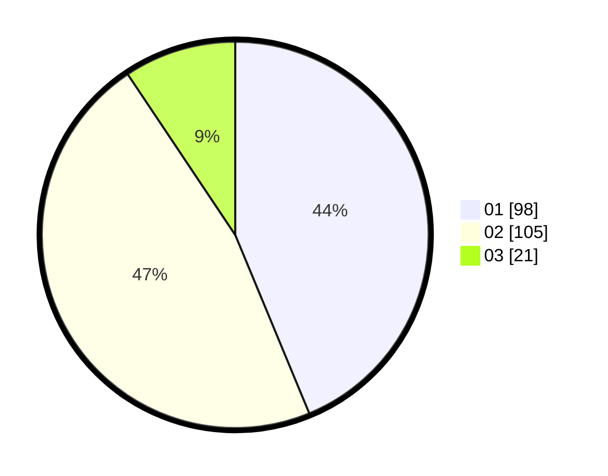

# Hasil

Hasil perolehan suara paslon dapat dilihat pada file paslon-01.txt, paslon-02.txt, dan paslon-03.txt.

Jika tidak ada, artinya data tersebut belum ada pada SIREKAP.

## Perolehan Suara

 * Paslon 01: **98**.
 * Paslon 02: **105**.
 * Paslon 03: **21**.

## Foto C Plano

https://sirekap-obj-formc.kpu.go.id/c6ec/pemilu/ppwp/31/72/03/10/05/3172031005096-20240217-114043--f1e9c2c3-68fa-4460-9450-2bfc74619517.jpg

https://sirekap-obj-formc.kpu.go.id/c6ec/pemilu/ppwp/31/72/03/10/05/3172031005096-20240217-114813--603c483d-6f93-4106-ac78-c1b7ff0705e5.jpg

https://sirekap-obj-formc.kpu.go.id/c6ec/pemilu/ppwp/31/72/03/10/05/3172031005096-20240217-115338--136e9967-f3a6-48df-bb93-c824f14168f6.jpg

## DATA PEMILIH TETAP

Jumlah pemilih dalam DPT: **285**.
 * L: **139**.
 * P: **146**.

## DATA PENGGUNA HAK PILIH

Jumlah pengguna hak pilih dalam DPT: **221**.
 * L: **114**.
 * P: **107**.

Jumlah pengguna hak pilih dalam DPTb: **0**.
 * L: **0**.
 * P: **0**.

Jumlah pengguna hak pilih dalam DPK: **4**.
 * L: **1**.
 * P: **3**.

Jumlah pengguna hak pilih: **225**.
 * L: **115**.
 * P: **110**.

## JUMLAH SUARA SAH DAN TIDAK SAH

JUMLAH SELURUH SUARA SAH: **224**.

JUMLAH SUARA TIDAK SAH: **1**.

JUMLAH SELURUH SUARA SAH DAN SUARA TIDAK SAH: **225**.
