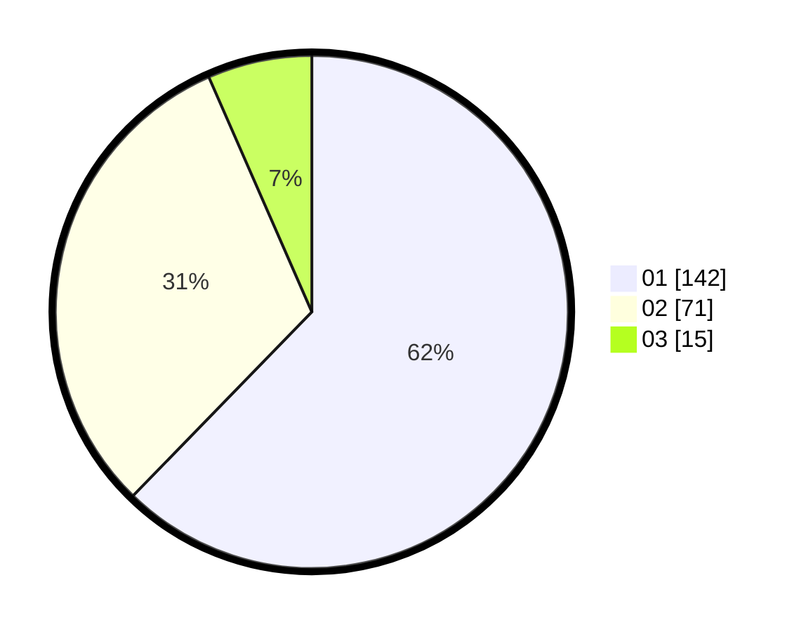

# Hasil

Hasil perolehan suara paslon dapat dilihat pada file paslon-01.txt, paslon-02.txt, dan paslon-03.txt.

Jika tidak ada, artinya data tersebut belum ada pada SIREKAP.

## Perolehan Suara

 * Paslon 01: **142**.
 * Paslon 02: **71**.
 * Paslon 03: **15**.

## Foto C Plano

https://sirekap-obj-formc.kpu.go.id/0c61/pemilu/ppwp/31/72/03/10/05/3172031005097-20240218-172004--7bfb3193-c162-48fb-914f-369bde40e02a.jpg

https://sirekap-obj-formc.kpu.go.id/0c61/pemilu/ppwp/31/72/03/10/05/3172031005097-20240218-173052--c043ea9f-b002-44da-946c-a47c7bfcd275.jpg

https://sirekap-obj-formc.kpu.go.id/0c61/pemilu/ppwp/31/72/03/10/05/3172031005097-20240218-173207--44f6d4cd-af04-4a35-8ce8-110f9e3944b5.jpg

## DATA PEMILIH TETAP

Jumlah pemilih dalam DPT: **284**.
 * L: **128**.
 * P: **156**.

## DATA PENGGUNA HAK PILIH

Jumlah pengguna hak pilih dalam DPT: **230**.
 * L: **101**.
 * P: **129**.

Jumlah pengguna hak pilih dalam DPTb: **0**.
 * L: **0**.
 * P: **0**.

Jumlah pengguna hak pilih dalam DPK: **0**.
 * L: **0**.
 * P: **0**.

Jumlah pengguna hak pilih: **230**.
 * L: **101**.
 * P: **129**.

## JUMLAH SUARA SAH DAN TIDAK SAH

JUMLAH SELURUH SUARA SAH: **228**.

JUMLAH SUARA TIDAK SAH: **2**.

JUMLAH SELURUH SUARA SAH DAN SUARA TIDAK SAH: **230**.
