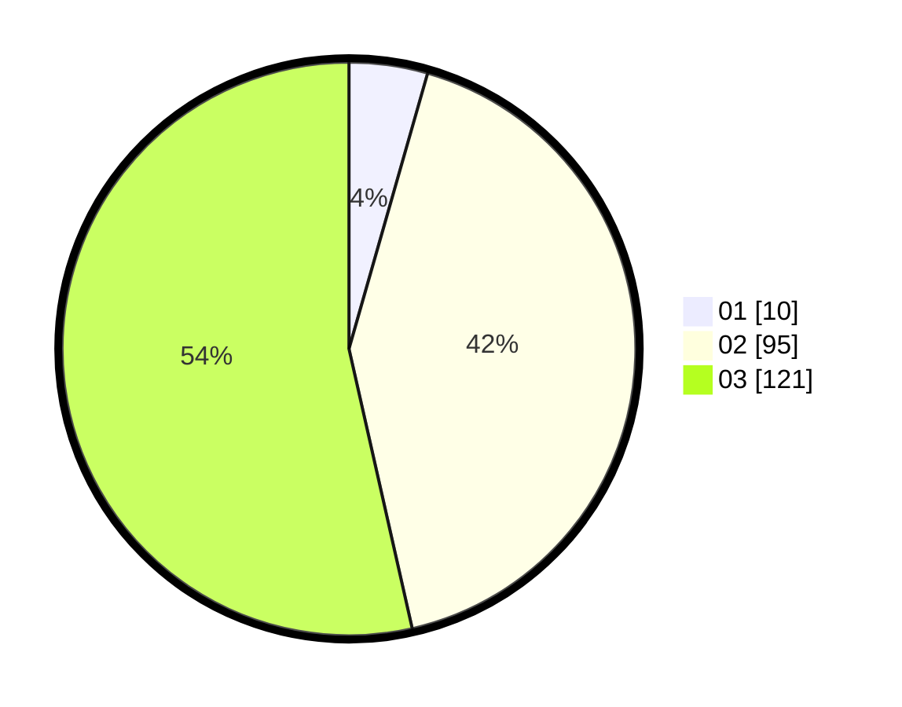

# Hasil

Hasil perolehan suara paslon dapat dilihat pada file paslon-01.txt, paslon-02.txt, dan paslon-03.txt.

Jika tidak ada, artinya data tersebut belum ada pada SIREKAP.

## Perolehan Suara

 * Paslon 01: **10**.
 * Paslon 02: **95**.
 * Paslon 03: **121**.

## Foto C Plano

https://sirekap-obj-formc.kpu.go.id/bb6e/pemilu/ppwp/31/72/03/10/05/3172031005102-20240218-173454--95104a57-2738-4c6d-a281-be427b7a7c75.jpg

https://sirekap-obj-formc.kpu.go.id/bb6e/pemilu/ppwp/31/72/03/10/05/3172031005102-20240218-173457--d133c231-31d4-481f-8f78-6632f7632819.jpg

https://sirekap-obj-formc.kpu.go.id/bb6e/pemilu/ppwp/31/72/03/10/05/3172031005102-20240218-173500--f6c8a0d4-9298-468d-8c75-02dd4ec1f5a4.jpg

## DATA PEMILIH TETAP

Jumlah pemilih dalam DPT: **280**.
 * L: **125**.
 * P: **155**.

## DATA PENGGUNA HAK PILIH

Jumlah pengguna hak pilih dalam DPT: **202**.
 * L: **92**.
 * P: **110**.

Jumlah pengguna hak pilih dalam DPTb: **16**.
 * L: **9**.
 * P: **7**.

Jumlah pengguna hak pilih dalam DPK: **10**.
 * L: **4**.
 * P: **6**.

Jumlah pengguna hak pilih: **228**.
 * L: **105**.
 * P: **123**.

## JUMLAH SUARA SAH DAN TIDAK SAH

JUMLAH SELURUH SUARA SAH: **226**.

JUMLAH SUARA TIDAK SAH: **2**.

JUMLAH SELURUH SUARA SAH DAN SUARA TIDAK SAH: **228**.
