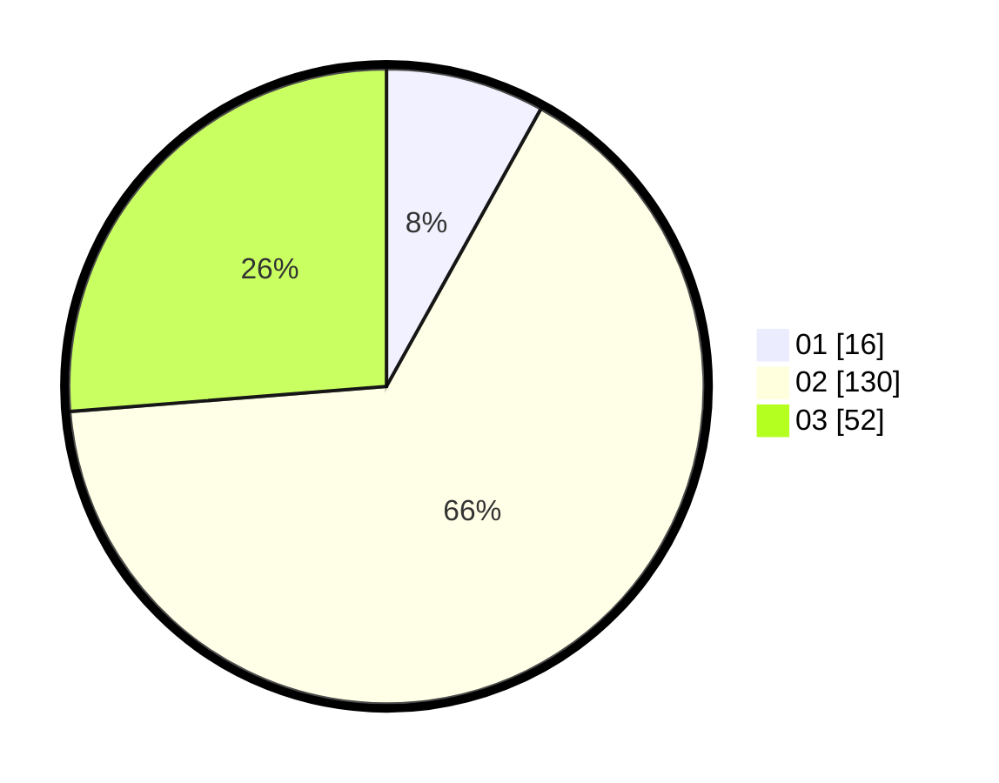

# Hasil

Hasil perolehan suara paslon dapat dilihat pada file paslon-01.txt, paslon-02.txt, dan paslon-03.txt.

Jika tidak ada, artinya data tersebut belum ada pada SIREKAP.

## Perolehan Suara

 * Paslon 01: **16**.
 * Paslon 02: **130**.
 * Paslon 03: **52**.

## Foto C Plano

https://sirekap-obj-formc.kpu.go.id/1dea/pemilu/ppwp/31/72/03/10/05/3172031005125-20240214-232313--7588364c-5320-4e8f-9dfd-43bac931a97d.jpg

https://sirekap-obj-formc.kpu.go.id/1dea/pemilu/ppwp/31/72/03/10/05/3172031005125-20240214-232305--e860b4e6-cbbb-4b00-ba45-b75d3a626065.jpg

https://sirekap-obj-formc.kpu.go.id/1dea/pemilu/ppwp/31/72/03/10/05/3172031005125-20240214-232259--c9277874-fd2a-4277-a3e9-c32ecf8d0129.jpg

## DATA PEMILIH TETAP

Jumlah pemilih dalam DPT: **283**.
 * L: **146**.
 * P: **137**.

## DATA PENGGUNA HAK PILIH

Jumlah pengguna hak pilih dalam DPT: **186**.
 * L: **93**.
 * P: **93**.

Jumlah pengguna hak pilih dalam DPTb: **10**.
 * L: **4**.
 * P: **6**.

Jumlah pengguna hak pilih dalam DPK: **4**.
 * L: **1**.
 * P: **3**.

Jumlah pengguna hak pilih: **200**.
 * L: **98**.
 * P: **102**.

## JUMLAH SUARA SAH DAN TIDAK SAH

JUMLAH SELURUH SUARA SAH: **198**.

JUMLAH SUARA TIDAK SAH: **2**.

JUMLAH SELURUH SUARA SAH DAN SUARA TIDAK SAH: **200**.
