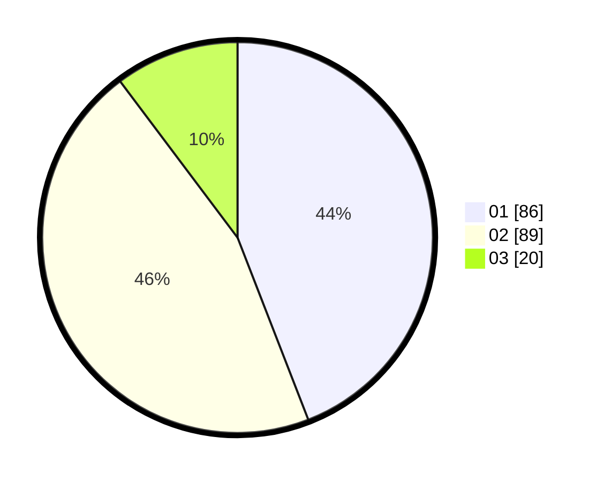

# Hasil

Hasil perolehan suara paslon dapat dilihat pada file paslon-01.txt, paslon-02.txt, dan paslon-03.txt.

Jika tidak ada, artinya data tersebut belum ada pada SIREKAP.

## Perolehan Suara

 * Paslon 01: **86**.
 * Paslon 02: **89**.
 * Paslon 03: **20**.

## Foto C Plano

https://sirekap-obj-formc.kpu.go.id/85d6/pemilu/ppwp/31/72/03/10/06/3172031006001-20240214-235822--cd753871-37a0-46f3-b9f6-9d308a871767.jpg

https://sirekap-obj-formc.kpu.go.id/85d6/pemilu/ppwp/31/72/03/10/06/3172031006001-20240215-000536--4875fe90-432b-4924-9404-fb78d03219ba.jpg

https://sirekap-obj-formc.kpu.go.id/85d6/pemilu/ppwp/31/72/03/10/06/3172031006001-20240215-000632--42c98343-d8f2-42b6-870a-433733bc1227.jpg
