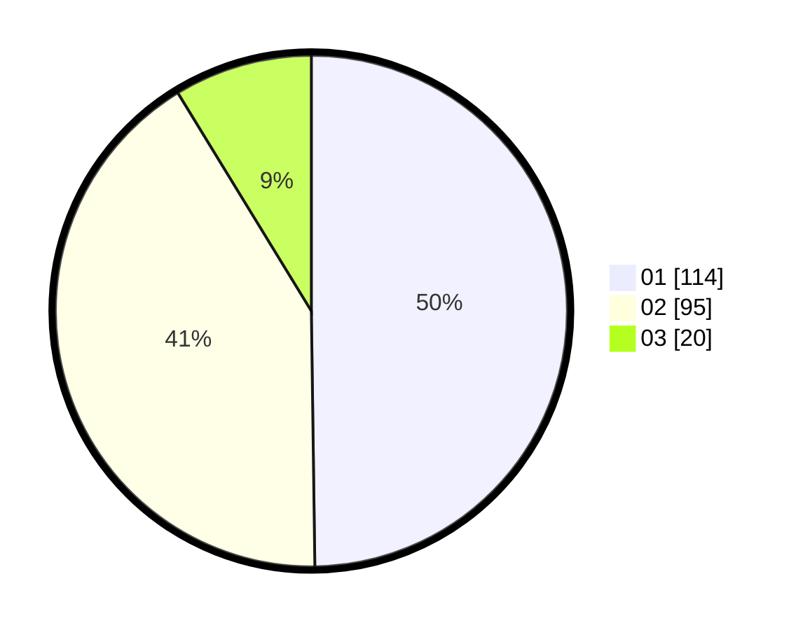

# Hasil

Hasil perolehan suara paslon dapat dilihat pada file paslon-01.txt, paslon-02.txt, dan paslon-03.txt.

Jika tidak ada, artinya data tersebut belum ada pada SIREKAP.

## Perolehan Suara

 * Paslon 01: **114**.
 * Paslon 02: **95**.
 * Paslon 03: **20**.

## Foto C Plano

https://sirekap-obj-formc.kpu.go.id/3692/pemilu/ppwp/31/72/03/10/06/3172031006004-20240214-221503--5c751078-c2ea-4fa6-be69-0b51a5c4a008.jpg

https://sirekap-obj-formc.kpu.go.id/3692/pemilu/ppwp/31/72/03/10/06/3172031006004-20240214-221427--493ed484-8377-4486-a014-5a5cb07a4216.jpg

https://sirekap-obj-formc.kpu.go.id/3692/pemilu/ppwp/31/72/03/10/06/3172031006004-20240214-221609--9c20958d-d897-4328-bcf1-d57dbf951b62.jpg

## DATA PEMILIH TETAP

Jumlah pemilih dalam DPT: **285**.
 * L: **132**.
 * P: **153**.

## DATA PENGGUNA HAK PILIH

Jumlah pengguna hak pilih dalam DPT: **226**.
 * L: **105**.
 * P: **121**.

Jumlah pengguna hak pilih dalam DPTb: **0**.
 * L: **0**.
 * P: **0**.

Jumlah pengguna hak pilih dalam DPK: **9**.
 * L: **3**.
 * P: **6**.

Jumlah pengguna hak pilih: **235**.
 * L: **108**.
 * P: **127**.

## JUMLAH SUARA SAH DAN TIDAK SAH

JUMLAH SELURUH SUARA SAH: **229**.

JUMLAH SUARA TIDAK SAH: **6**.

JUMLAH SELURUH SUARA SAH DAN SUARA TIDAK SAH: **235**.
