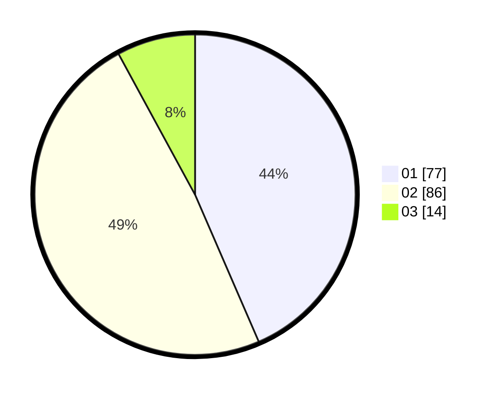

# Hasil

Hasil perolehan suara paslon dapat dilihat pada file paslon-01.txt, paslon-02.txt, dan paslon-03.txt.

Jika tidak ada, artinya data tersebut belum ada pada SIREKAP.

## Perolehan Suara

 * Paslon 01: **77**.
 * Paslon 02: **86**.
 * Paslon 03: **14**.

## Foto C Plano

https://sirekap-obj-formc.kpu.go.id/71e4/pemilu/ppwp/31/72/03/10/06/3172031006007-20240214-160101--13666b3a-a2e1-46cd-aee5-ed18bb3ccd65.jpg

https://sirekap-obj-formc.kpu.go.id/71e4/pemilu/ppwp/31/72/03/10/06/3172031006007-20240214-155916--f3049022-9e3f-42c2-8833-a08f64347634.jpg

https://sirekap-obj-formc.kpu.go.id/71e4/pemilu/ppwp/31/72/03/10/06/3172031006007-20240214-160116--2c18155f-7469-4abe-b757-08e228bc7dec.jpg
