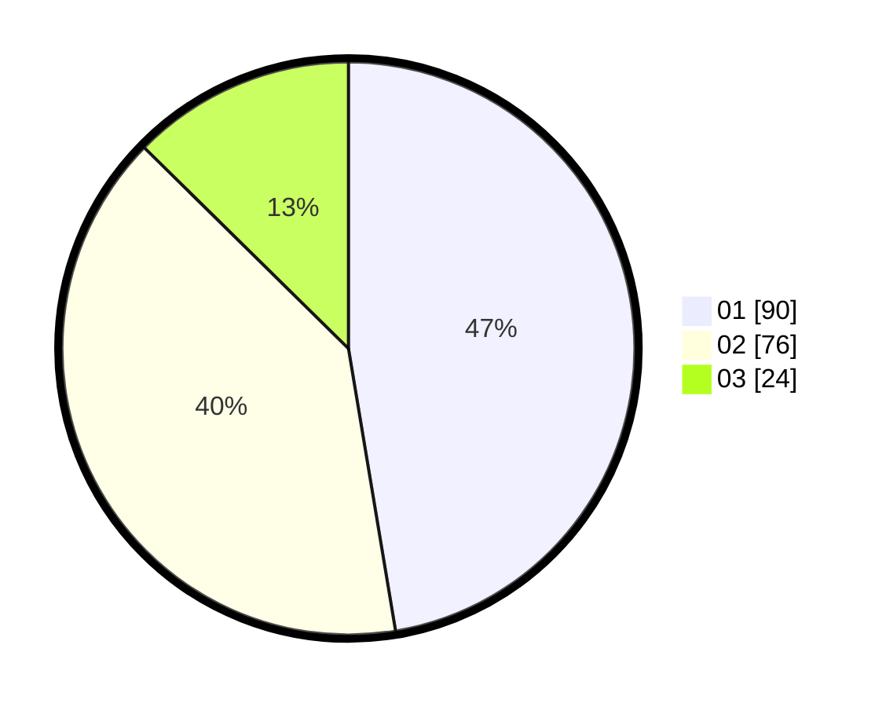

# Hasil

Hasil perolehan suara paslon dapat dilihat pada file paslon-01.txt, paslon-02.txt, dan paslon-03.txt.

Jika tidak ada, artinya data tersebut belum ada pada SIREKAP.

## Perolehan Suara

 * Paslon 01: **90**.
 * Paslon 02: **76**.
 * Paslon 03: **24**.

## Foto C Plano

https://sirekap-obj-formc.kpu.go.id/b30e/pemilu/ppwp/31/72/03/10/06/3172031006008-20240216-161537--18f142fe-8448-4b97-8d3f-0b976c7826f9.jpg

https://sirekap-obj-formc.kpu.go.id/b30e/pemilu/ppwp/31/72/03/10/06/3172031006008-20240216-162417--9066b3f6-3893-43a2-9863-962411105514.jpg

https://sirekap-obj-formc.kpu.go.id/b30e/pemilu/ppwp/31/72/03/10/06/3172031006008-20240216-163509--df49d871-4a15-438d-9df2-fa548f4e9f17.jpg

## DATA PEMILIH TETAP

Jumlah pemilih dalam DPT: **279**.
 * L: **149**.
 * P: **130**.

## DATA PENGGUNA HAK PILIH

Jumlah pengguna hak pilih dalam DPT: **192**.
 * L: **96**.
 * P: **96**.

Jumlah pengguna hak pilih dalam DPTb: **0**.
 * L: **0**.
 * P: **0**.

Jumlah pengguna hak pilih dalam DPK: **0**.
 * L: **0**.
 * P: **0**.

Jumlah pengguna hak pilih: **192**.
 * L: **96**.
 * P: **96**.

## JUMLAH SUARA SAH DAN TIDAK SAH

JUMLAH SELURUH SUARA SAH: **190**.

JUMLAH SUARA TIDAK SAH: **2**.

JUMLAH SELURUH SUARA SAH DAN SUARA TIDAK SAH: **192**.
