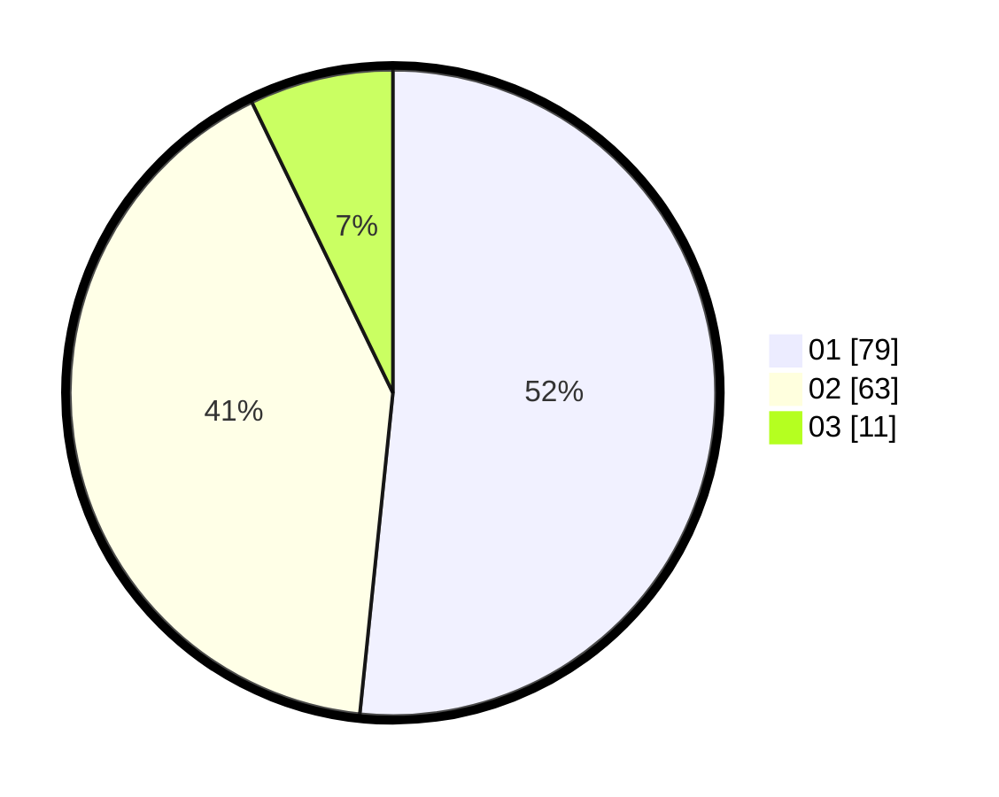

# Hasil

Hasil perolehan suara paslon dapat dilihat pada file paslon-01.txt, paslon-02.txt, dan paslon-03.txt.

Jika tidak ada, artinya data tersebut belum ada pada SIREKAP.

## Perolehan Suara

 * Paslon 01: **79**.
 * Paslon 02: **63**.
 * Paslon 03: **11**.

## Foto C Plano

https://sirekap-obj-formc.kpu.go.id/aea0/pemilu/ppwp/31/72/03/10/06/3172031006010-20240216-164505--fc7e67b2-0aa7-4744-a1ff-372aff248523.jpg

https://sirekap-obj-formc.kpu.go.id/aea0/pemilu/ppwp/31/72/03/10/06/3172031006010-20240216-165749--8fb65430-bde5-4fff-b315-862b9900f110.jpg

https://sirekap-obj-formc.kpu.go.id/aea0/pemilu/ppwp/31/72/03/10/06/3172031006010-20240216-165748--9146abcb-18d6-4073-aa6b-0e95fef2fdcb.jpg

## DATA PEMILIH TETAP

Jumlah pemilih dalam DPT: **259**.
 * L: **125**.
 * P: **134**.

## DATA PENGGUNA HAK PILIH

Jumlah pengguna hak pilih dalam DPT: **153**.
 * L: **68**.
 * P: **85**.

Jumlah pengguna hak pilih dalam DPTb: **4**.
 * L: **3**.
 * P: **1**.

Jumlah pengguna hak pilih dalam DPK: **0**.
 * L: **0**.
 * P: **0**.

Jumlah pengguna hak pilih: **157**.
 * L: **71**.
 * P: **86**.

## JUMLAH SUARA SAH DAN TIDAK SAH

JUMLAH SELURUH SUARA SAH: **153**.

JUMLAH SUARA TIDAK SAH: **4**.

JUMLAH SELURUH SUARA SAH DAN SUARA TIDAK SAH: **157**.
