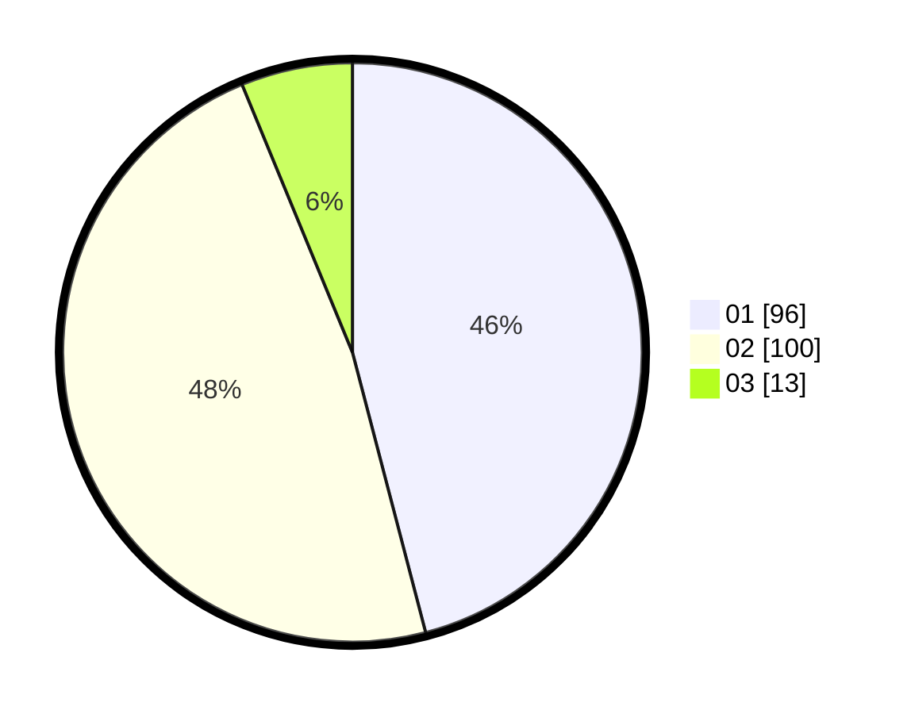

# Hasil

Hasil perolehan suara paslon dapat dilihat pada file paslon-01.txt, paslon-02.txt, dan paslon-03.txt.

Jika tidak ada, artinya data tersebut belum ada pada SIREKAP.

## Perolehan Suara

 * Paslon 01: **96**.
 * Paslon 02: **100**.
 * Paslon 03: **13**.

## Foto C Plano

https://sirekap-obj-formc.kpu.go.id/d97a/pemilu/ppwp/31/72/03/10/06/3172031006014-20240216-175943--c64a8040-b4bc-43fc-89da-934f928f8d21.jpg

https://sirekap-obj-formc.kpu.go.id/d97a/pemilu/ppwp/31/72/03/10/06/3172031006014-20240216-180013--a94b0a0b-cdad-4460-89e7-cbffaa1c9da5.jpg

https://sirekap-obj-formc.kpu.go.id/d97a/pemilu/ppwp/31/72/03/10/06/3172031006014-20240216-180050--07bd9123-450f-43ff-ba41-9c99bf140848.jpg

## DATA PEMILIH TETAP

Jumlah pemilih dalam DPT: **288**.
 * L: **159**.
 * P: **129**.

## DATA PENGGUNA HAK PILIH

Jumlah pengguna hak pilih dalam DPT: **215**.
 * L: **116**.
 * P: **99**.

Jumlah pengguna hak pilih dalam DPTb: **0**.
 * L: **0**.
 * P: **0**.

Jumlah pengguna hak pilih dalam DPK: **0**.
 * L: **0**.
 * P: **0**.

Jumlah pengguna hak pilih: **215**.
 * L: **116**.
 * P: **99**.

## JUMLAH SUARA SAH DAN TIDAK SAH

JUMLAH SELURUH SUARA SAH: **209**.

JUMLAH SUARA TIDAK SAH: **6**.

JUMLAH SELURUH SUARA SAH DAN SUARA TIDAK SAH: **215**.
