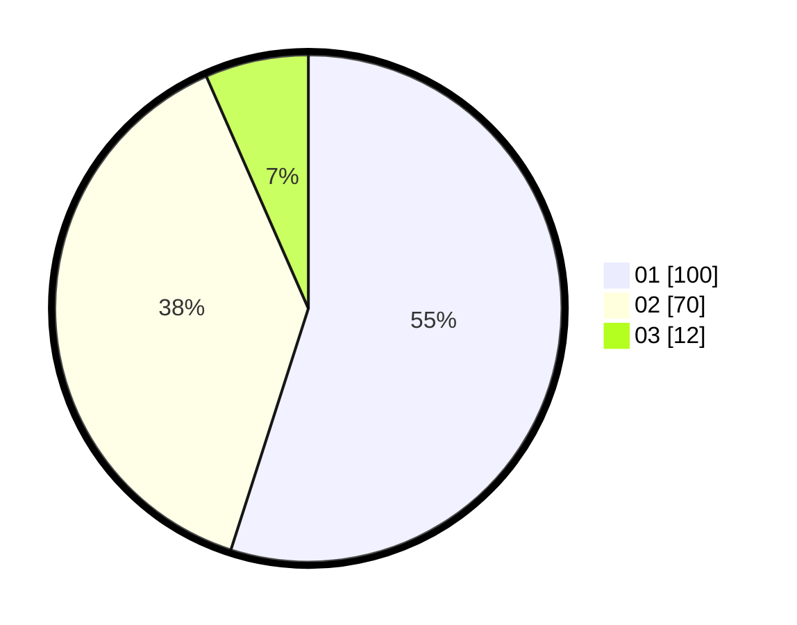

# Hasil

Hasil perolehan suara paslon dapat dilihat pada file paslon-01.txt, paslon-02.txt, dan paslon-03.txt.

Jika tidak ada, artinya data tersebut belum ada pada SIREKAP.

## Perolehan Suara

 * Paslon 01: **100**.
 * Paslon 02: **70**.
 * Paslon 03: **12**.

## Foto C Plano

https://sirekap-obj-formc.kpu.go.id/923d/pemilu/ppwp/31/72/03/10/06/3172031006016-20240214-155915--979aa0e2-506e-4c89-add9-182e01ab434c.jpg

https://sirekap-obj-formc.kpu.go.id/923d/pemilu/ppwp/31/72/03/10/06/3172031006016-20240214-155835--cc6b85db-55a5-4d44-a915-3be6b4bb22f7.jpg

https://sirekap-obj-formc.kpu.go.id/923d/pemilu/ppwp/31/72/03/10/06/3172031006016-20240214-160059--5f4c7baa-2446-477f-9428-8e6cd91959d9.jpg

## DATA PEMILIH TETAP

Jumlah pemilih dalam DPT: **258**.
 * L: **140**.
 * P: **118**.

## DATA PENGGUNA HAK PILIH

Jumlah pengguna hak pilih dalam DPT: **180**.
 * L: **99**.
 * P: **81**.

Jumlah pengguna hak pilih dalam DPTb: **0**.
 * L: **0**.
 * P: **0**.

Jumlah pengguna hak pilih dalam DPK: **4**.
 * L: **0**.
 * P: **4**.

Jumlah pengguna hak pilih: **184**.
 * L: **99**.
 * P: **85**.

## JUMLAH SUARA SAH DAN TIDAK SAH

JUMLAH SELURUH SUARA SAH: **182**.

JUMLAH SUARA TIDAK SAH: **2**.

JUMLAH SELURUH SUARA SAH DAN SUARA TIDAK SAH: **184**.
