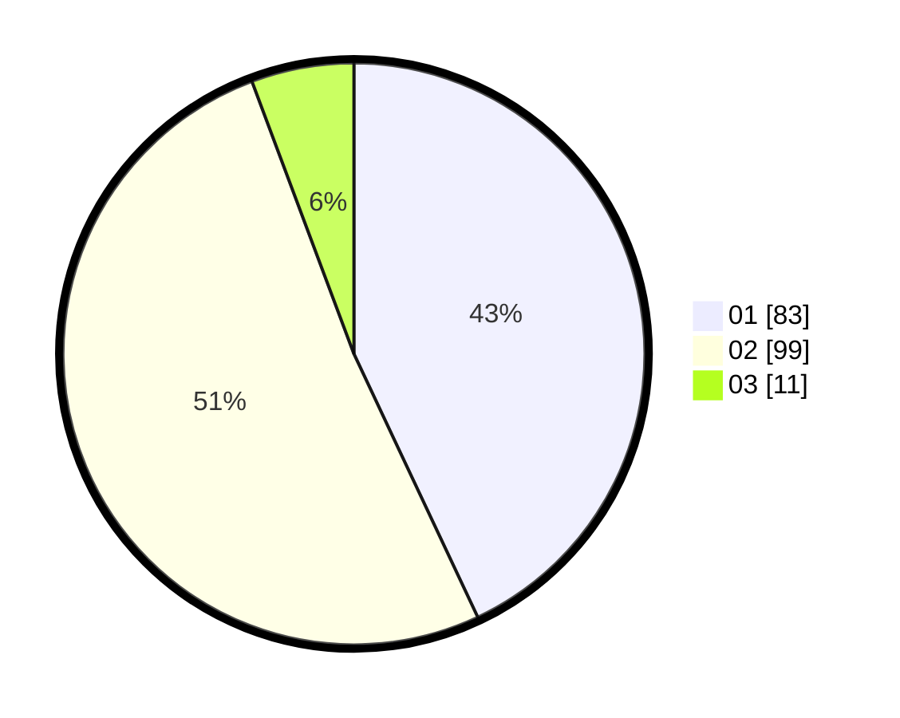

# Hasil

Hasil perolehan suara paslon dapat dilihat pada file paslon-01.txt, paslon-02.txt, dan paslon-03.txt.

Jika tidak ada, artinya data tersebut belum ada pada SIREKAP.

## Perolehan Suara

 * Paslon 01: **83**.
 * Paslon 02: **99**.
 * Paslon 03: **11**.

## Foto C Plano

https://sirekap-obj-formc.kpu.go.id/1d67/pemilu/ppwp/31/72/03/10/06/3172031006021-20240214-232800--ae2f1f89-277f-4ae7-8d6a-9cafe080639c.jpg

https://sirekap-obj-formc.kpu.go.id/1d67/pemilu/ppwp/31/72/03/10/06/3172031006021-20240214-232943--352d421b-02e7-481b-ae72-dadd6e6e52e3.jpg

https://sirekap-obj-formc.kpu.go.id/1d67/pemilu/ppwp/31/72/03/10/06/3172031006021-20240214-233129--5eec8ce1-ccc2-4be1-953a-6151b1b0525f.jpg

## DATA PEMILIH TETAP

Jumlah pemilih dalam DPT: **281**.
 * L: **131**.
 * P: **150**.

## DATA PENGGUNA HAK PILIH

Jumlah pengguna hak pilih dalam DPT: **194**.
 * L: **88**.
 * P: **106**.

Jumlah pengguna hak pilih dalam DPTb: **1**.
 * L: **0**.
 * P: **1**.

Jumlah pengguna hak pilih dalam DPK: **0**.
 * L: **0**.
 * P: **0**.

Jumlah pengguna hak pilih: **195**.
 * L: **88**.
 * P: **107**.

## JUMLAH SUARA SAH DAN TIDAK SAH

JUMLAH SELURUH SUARA SAH: **193**.

JUMLAH SUARA TIDAK SAH: **2**.

JUMLAH SELURUH SUARA SAH DAN SUARA TIDAK SAH: **195**.
