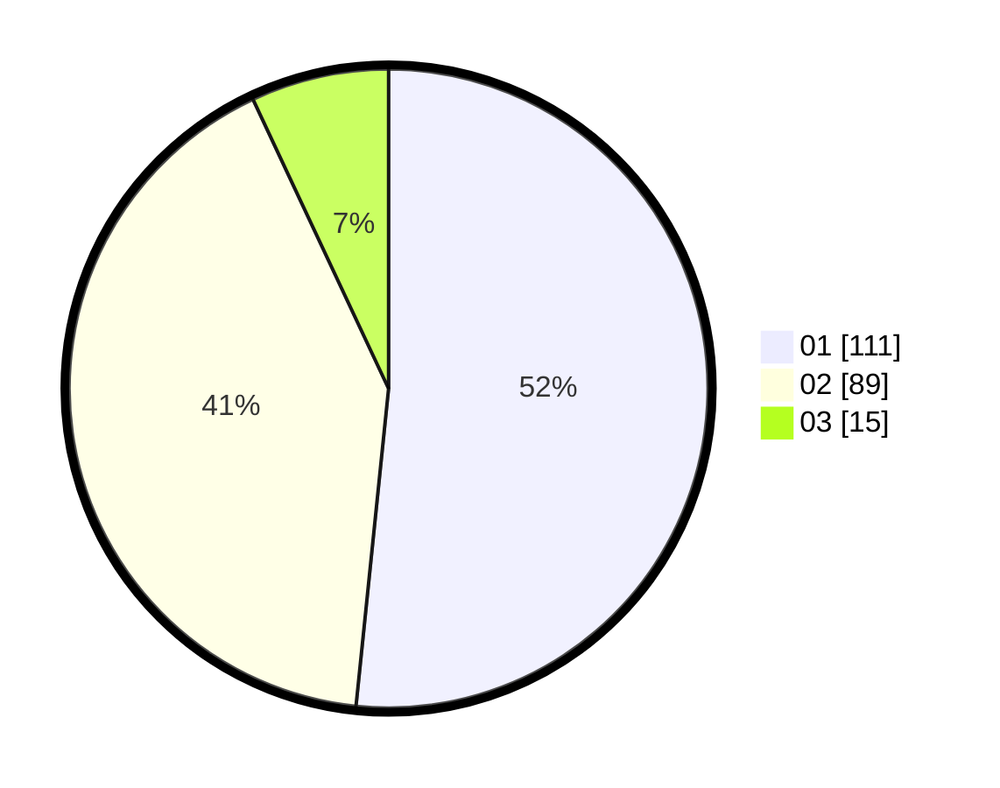

# Hasil

Hasil perolehan suara paslon dapat dilihat pada file paslon-01.txt, paslon-02.txt, dan paslon-03.txt.

Jika tidak ada, artinya data tersebut belum ada pada SIREKAP.

## Perolehan Suara

 * Paslon 01: **111**.
 * Paslon 02: **89**.
 * Paslon 03: **15**.

## Foto C Plano

https://sirekap-obj-formc.kpu.go.id/3b1c/pemilu/ppwp/31/72/03/10/06/3172031006022-20240215-020956--2cf223cb-8c58-4f4f-bd56-fe470d6f04b1.jpg

https://sirekap-obj-formc.kpu.go.id/3b1c/pemilu/ppwp/31/72/03/10/06/3172031006022-20240215-021140--5d7d5f48-1f83-4025-913f-eff588e2e584.jpg

https://sirekap-obj-formc.kpu.go.id/3b1c/pemilu/ppwp/31/72/03/10/06/3172031006022-20240215-021452--7b00cdd4-0577-4b0a-80d3-33c448b384d9.jpg
