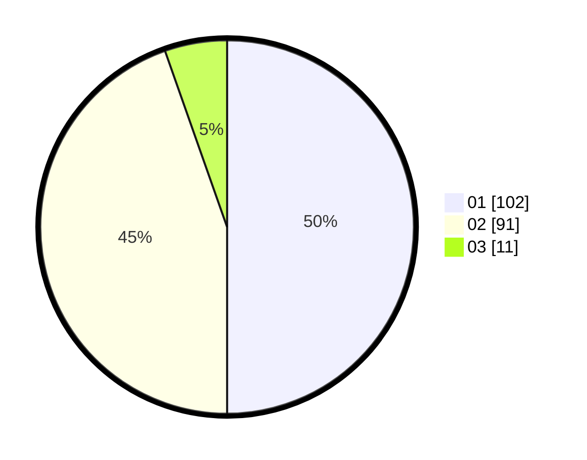

# Hasil

Hasil perolehan suara paslon dapat dilihat pada file paslon-01.txt, paslon-02.txt, dan paslon-03.txt.

Jika tidak ada, artinya data tersebut belum ada pada SIREKAP.

## Perolehan Suara

 * Paslon 01: **102**.
 * Paslon 02: **91**.
 * Paslon 03: **11**.

## Foto C Plano

https://sirekap-obj-formc.kpu.go.id/b84f/pemilu/ppwp/31/72/03/10/06/3172031006026-20240214-162213--07abb2b4-e97a-454c-ae86-06f2761ad947.jpg

https://sirekap-obj-formc.kpu.go.id/b84f/pemilu/ppwp/31/72/03/10/06/3172031006026-20240214-190512--d8216915-32ec-4de9-8979-03b50a8f6594.jpg

https://sirekap-obj-formc.kpu.go.id/b84f/pemilu/ppwp/31/72/03/10/06/3172031006026-20240214-192606--b47a8061-3f76-4980-bb53-51bf90fd2b97.jpg

## DATA PEMILIH TETAP

Jumlah pemilih dalam DPT: **268**.
 * L: **142**.
 * P: **126**.

## DATA PENGGUNA HAK PILIH

Jumlah pengguna hak pilih dalam DPT: **204**.
 * L: **105**.
 * P: **99**.

Jumlah pengguna hak pilih dalam DPTb: **1**.
 * L: **0**.
 * P: **1**.

Jumlah pengguna hak pilih dalam DPK: **1**.
 * L: **0**.
 * P: **1**.

Jumlah pengguna hak pilih: **206**.
 * L: **105**.
 * P: **101**.

## JUMLAH SUARA SAH DAN TIDAK SAH

JUMLAH SELURUH SUARA SAH: **204**.

JUMLAH SUARA TIDAK SAH: **2**.

JUMLAH SELURUH SUARA SAH DAN SUARA TIDAK SAH: **206**.
