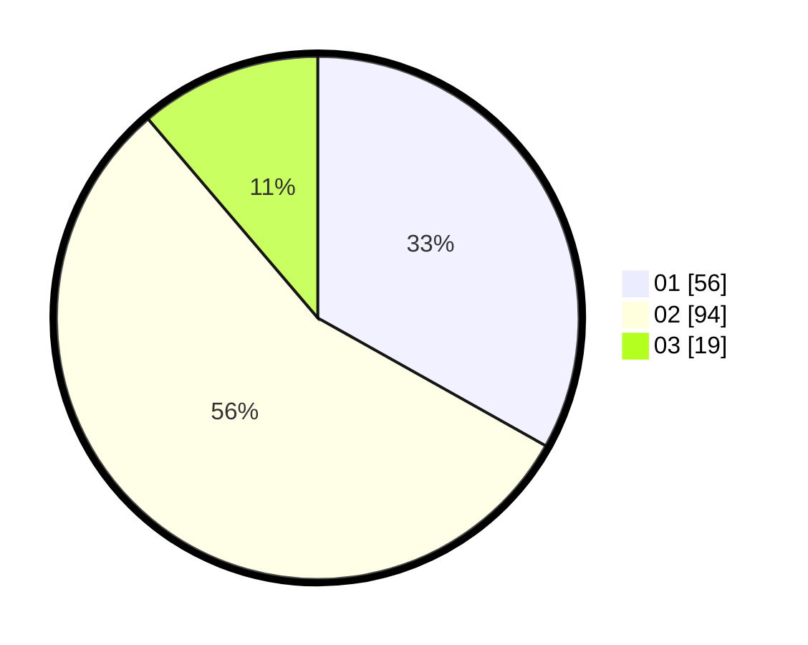

# Hasil

Hasil perolehan suara paslon dapat dilihat pada file paslon-01.txt, paslon-02.txt, dan paslon-03.txt.

Jika tidak ada, artinya data tersebut belum ada pada SIREKAP.

## Perolehan Suara

 * Paslon 01: **56**.
 * Paslon 02: **94**.
 * Paslon 03: **19**.

## Foto C Plano

https://sirekap-obj-formc.kpu.go.id/a8d0/pemilu/ppwp/31/72/03/10/06/3172031006030-20240215-005105--d3119764-d6e1-4cf1-aee4-45c6963a178f.jpg

https://sirekap-obj-formc.kpu.go.id/a8d0/pemilu/ppwp/31/72/03/10/06/3172031006030-20240215-005325--07d5adb2-646f-4823-b5d7-050446444b2e.jpg

https://sirekap-obj-formc.kpu.go.id/a8d0/pemilu/ppwp/31/72/03/10/06/3172031006030-20240215-005452--c40bdbd0-0a88-4bff-948b-ee52863a3962.jpg
